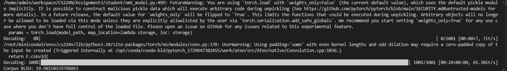

# Assignment 4 Self-Attention, Transformer, and Pretraining
1. **Mathematical exploration**
2. **Extending a research codebase**

## Attention Exploration
1. **Copying in attention**
2. **A average of two** We want to incorporate information from **two** vectors $v_a$ and $v_b$, with corresponding key vectors $k_a$ and $k_b$. Assume that all key vector are orthogonal, so $k_i^Tk_j=0$ for all $i \neq j$ and all key vectors have norm 1. **Find an expression** for a query vector $q$ such that $c \approx \frac{1}{2}(v_a + v_b)$

The answer is 
$$
q = \frac{1}{2}(k_j + k_i)
$$
3. **Drawbacks of single-headed attention** 
    1. 和上述答案一样
4. **Benefits of multi-headed attention**

## Position Embedding Exploration
Attention layer,
$$
Q = XW_Q,\ K=XW_K,\ V=XW_V
\\ H = softmax(\frac{QK_T}{\sqrt{d}})V
$$
Feed-forward layer,
$$
Z=ReLU(HW_1+1\cdot b_1)W_2 + 1\cdot b_2
$$

1. **Permuting the input**
    1. $X_{perm}=PX\ \rightarrow Z_{perm}=PZ$
    这个公式可以看出来attention block之后的contextual embedding实际上是bag of word，只与这个词袋有关，但与序列无关
2. **Position embeddings**
    One approach is to generate position embedding using a fixed function of the position and the dimension of the embedding.
    If the input word embeddings are $X\in R^{T \times d}$
    The position embeddings $\Phi \in R^{T \times d}$ 
    $$
    \Phi_{(t,2i)} = sin(t/10000^{2i/d})
    \\ \Phi_{(t,2i+1)} = cos(t/10000^{2i/d})
    $$
    The position embeddings are added to the input word embeddings:
    $$
    X_{pos} = X + \Phi
    $$