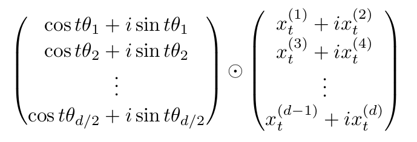

# Assignment 4 Self-Attention, Transformer, and Pretraining
1. **Mathematical exploration**
2. **Extending a research codebase**

## Attention Exploration
1. **Copying in attention**
2. **A average of two** We want to incorporate information from **two** vectors $v_a$ and $v_b$, with corresponding key vectors $k_a$ and $k_b$. Assume that all key vector are orthogonal, so $k_i^Tk_j=0$ for all $i \neq j$ and all key vectors have norm 1. **Find an expression** for a query vector $q$ such that $c \approx \frac{1}{2}(v_a + v_b)$

The answer is 
$$
q = \frac{1}{2}(k_j + k_i)
$$
3. **Drawbacks of single-headed attention** 
    1. 和上述答案一样
4. **Benefits of multi-headed attention**


## Position Embedding Exploration
Attention layer,
$$
Q = XW_Q,\ K=XW_K,\ V=XW_V
\\ H = softmax(\frac{QK_T}{\sqrt{d}})V
$$
Feed-forward layer,
$$
Z=ReLU(HW_1+1\cdot b_1)W_2 + 1\cdot b_2
$$

1. **Permuting the input**
    1. $X_{perm}=PX\ \rightarrow Z_{perm}=PZ$
    这个公式可以看出来attention block之后的contextual embedding实际上是bag of word，只与这个词袋有关，但与序列无关
2. **Position embeddings**
    One approach is to generate position embedding using a fixed function of the position and the dimension of the embedding.
    If the input word embeddings are $X\in R^{T \times d}$
    The position embeddings $\Phi \in R^{T \times d}$ 
    $$
    \Phi_{(t,2i)} = sin(t/10000^{2i/d})
    \\ \Phi_{(t,2i+1)} = cos(t/10000^{2i/d})
    $$
    The position embeddings are added to the input word embeddings:
    $$
    X_{pos} = X + \Phi
    $$
3. Pretrained Transformer models and knowledge access
```python
class CharCorruptionDataset(Dataset):
    def __init__(self, data, block_size):
        self.MASK_CHAR = "\u2047" # the doublequestionmark character, for mask
        self.PAD_CHAR = "\u25A1" # the empty square character, for pad

        chars = list(sorted(list(set(data))))
        assert self.MASK_CHAR not in chars
        assert self.PAD_CHAR not in chars
        chars.insert(0, self.MASK_CHAR)
        chars.insert(0, self.PAD_CHAR)

        self.stoi = {ch:i for i,ch in enumerate(chars)}
        self.itos = {i:ch for i,ch in enumerate(chars)}

        data_size, vocab_size = len(data), len(chars)
        print(f'data has {data_size} characters, {vocab_size} unique.')

        self.block_size = block_size
        self.vocab_size = vocab_size
        self.data = data.split('\n')
```
split the data, every line can be treated as a sample.

```python
class NameDataset(Dataset):
    def __init__(self, pretraining_dataset, data):
        self.MASK_CHAR = "\u2047" # the doublequestionmark character, for mask
        self.PAD_CHAR = "\u25A1" # the empty square character, for pad
        self.itos = pretraining_dataset.itos
        self.stoi = pretraining_dataset.stoi
        self.block_size = pretraining_dataset.block_size
        self.data = list(data.encode('utf-8').decode('ascii', errors='ignore').split('\n'))

    def __len__(self):
        return len(self.data) - 1

    def __getitem__(self, idx):
        inp, oup = self.data[idx].split('\t')
        x = inp + self.MASK_CHAR + oup + self.MASK_CHAR
        x = x + self.PAD_CHAR*(self.block_size - len(x))
        y = self.PAD_CHAR*(len(inp)-1) + x[len(inp):]

        x = x[:-1]
        x = torch.tensor([self.stoi[c] for c in x], dtype=torch.long)
        y = torch.tensor([self.stoi[c] for c in y], dtype=torch.long)
        return x, y
```
**（e）**
1. randomly truncate the document(a data entry) no less than 4 characters, no more than int(self.block_size*7/8) characters
2. break the truncated into
    [prefix] [masked_content] [suffix]
    the length of [masked_content] should be random, 1/4 the length of the truncated document on average
3. Rearrange these substrings into the following form:
    [prefix] MASK_CHAR [suffix] MASK_CHAR [masked_content] [pads]
4. construct the input and output example pair
5. encode the resulting input and output strings 

**(g)** Rotary Positional Embedding(RoPE)

Transformer won't perform well on context lengths much larger than it was trained on, because the distribution of the position embedding will be very different from the ones it was trained on.

**RoPE** alleviate this issue.
$$
RoPE(x_t^{(1)}, x_t^{(2)}, t) = (\begin{matrix}cost\theta&-sint\theta\\
sint\theta&cost\theta\end{matrix})(\begin{matrix}x_t^{(1)}\\x_t^{(2)}\end{matrix})
$$
For a $d$ dimentsional feature, **RoPE** is applied to each pair of features with an angle $\theta_i$, $\theta_i=10000^{-2(i-1)/d},i\in{1,2,...,d/2}$


instead of adding the positional embeddding to the input embeddings, **RoPE** is applied to the key and query vectors for each head in the attention block for all the Transformer layers.

1. operation can be viewed as rotation of the complex number $x_t^{(1)}+ix_t^{(2)}$ by an angle $t\theta$
So we can rewrite the RoPE operation as an element-wise multiplication of two vectors 


2. **Relative Embeddings** the dot product of the RoPE embeddings of two vectors at positions $t_1$ and $t_2$ depends on the relative position $t_1 - t_2$ only.