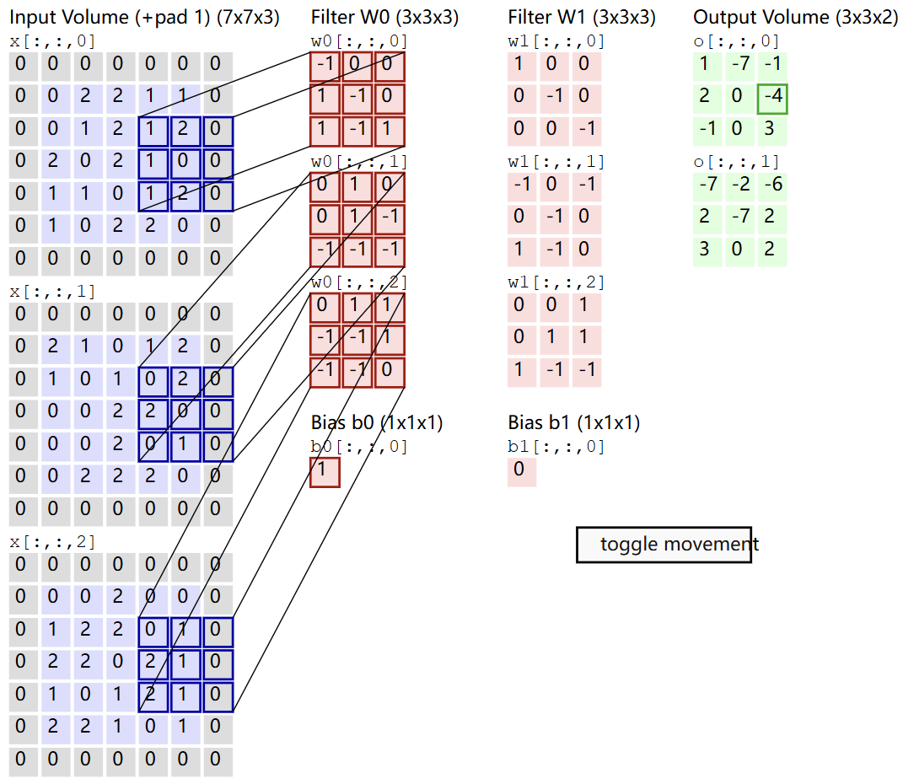

# CNN

The layers of a ConvNet have neurons arranged in 3 dimensions:**width, height, depth**

The size of the output volume: **depth, stride, zero-padding**
1. depth corresponds to the number of filter
2. stride is 2 means the filters jump 2 pixel at a time
3. zero-padding

The spatial size of the output volume is given by
$$
(W-F+2P)/S + 1
$$
$W$ is the input volume size. $F$ is the receptive field size of the Conv Layer neurons($F$). Stride is $S$.

Set zero padding to $P=(F-1)/2$ when stride $S=1$ would let input volume and output volume have the same size spatially.
