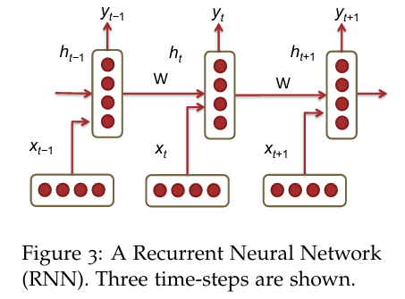
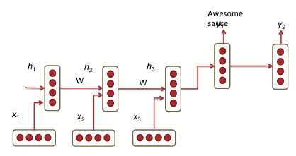
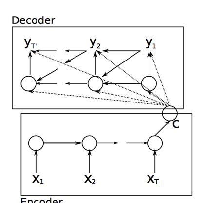
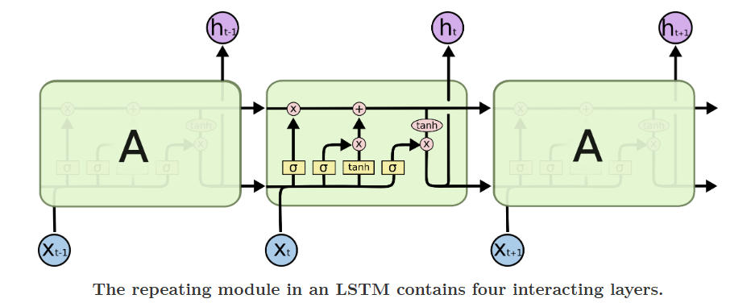
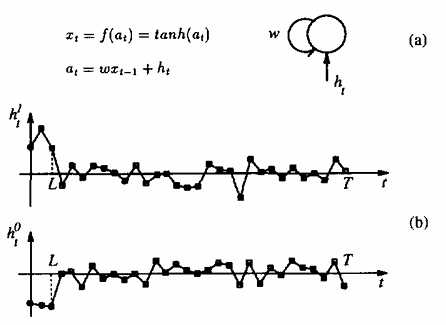

# Natural Language Processing with Deep Learning

## Language Models
$$
p(w_1,...,w_m)=\prod_{i=1}^{i=m}P(w_i|w_1,...,w_{i-1})\approx\prod_{i=1}^{i=m}P(w_i|w_{i-n},...,w_{i-1})
$$

### n-gram Language Models
$$
p(w_3|w_1,w_2)=\frac{count(w_1,w_2,w_3)}{count(w_1,w_2)}
$$
**Two main issues**
1. Sparsity problems 
e.g If $w_1,w_2$ and $w_3$ never appear together in the corpus, the probability of $w_3$ is 0. To solve this, a small $\delta$ should be added to the count for each word in the vocabulary.
If $w_1$ and $w_2$ never occurred together in the corpus, then no probability can be calculated for $w_3$
数据集有限，导致很可能不能为所有的组合计算出一个概率。

2. Storage problems with n-gram Language models
we need to store the count for all n-grams we saw in the corpus.
需要存储所有n-1个单词同时出现和n和单词同时出现的次数。模型随着n呈指数型增长

### Window-based Neural Language Model
Word2vec

## Recurrent Neural Networds(RNN)

Each vertical rectangular box is a hidden layer at a time-step $t$. 
$$
h_t=\sigma(W^{(hh)}h_{t-1}+W^{(hx)}x_t)
$$
$$
\hat{y}_t=softmax(W^{(S)}h_t)
$$
The parameter in the network
* $x_1,...,x_{t-1},x_t,x_{t+1},...,x_T$: the word vectors corresponding to a corpus with T words.
* $h_t=\sigma(W^{(hh)}h_{t-1} + W^{(hx)}x_t)$
* $\hat{y}_t=softmax(W^{(S)}h_t)$
只需要训练共用的权重$W^{（hh）},W^{(hx)}$

### RNN Loss and Perplexity
loss at time-step t
$$
J^{(t)}(\theta)=-\sum_{j=1}^{|V|}y_{t,j}\times log(\hat{y}_{t,j})
$$
So the cross entropy erros over a corpus of size $T$ is:
$$
J = \frac{1}{T}\sum_{t=1}^TJ^{(t)}(\theta)=-\frac{1}{T}\sum_{t=1}^T\sum_{j=1}^{|V|}y_{t,j} \times log(\hat{y}_{t,j})
$$
***Perplexity***
$$
Perplexity=2^J
$$

### Drawbacks of RNN
1. Computation is slow, can not be parallelized
2. Difficult to access information from many steps back(vanishing and exploding gradients)

### Vanishing Gradient & Gradient Explosion Problems
$$
\frac{\partial E}{\partial W}=\sum_{t=1}^T\frac{\partial E_t}{\partial W}
$$
the corresponding differentiation of $W$ is
$$
\frac{\partial E_t}{\partial W} = \sum_{k=1}^t \frac{\partial E_t}{\partial y_t} \frac{\partial y_t}{\partial h_t} \frac{\partial h_t}{\partial h_k} \frac{\partial h_k}{\partial W}
$$
链式法则求导即可
the relationship to compute each $dh_t/dh_k$
$$
\frac{\partial h_t}{\partial h_k}= \prod_{j=k+1}^t \frac{\partial h_j}{\partial h_{j-1}}=\prod_{j=k+1}^{t}W^T \times diag[f'(j_{j-1})]
$$
so
$$
\frac{\partial E}{\partial W} =\sum_{t=1}^T \sum_{k=1}^t \frac{\partial E_t}{\partial y_t} \frac{\partial y_t}{\partial h_t} \frac{\partial h_t}{\partial h_k} \frac{\partial h_k}{\partial W}
\\=\sum_{t=1}^T\sum_{k=1}^t \frac{\partial E_t}{\partial y_t} \frac{\partial y_t}{\partial h_t} (\prod_{j=k+1}^t \frac{\partial h_j}{\partial h_{j-1}}) \frac{\partial h_k}{\partial W}
$$
the norm of the Jacobian matrix relationship,($\beta_W\ and\ \beta_h$ represent the upper bound values fro the two matrix norms)
$$
||\frac{\partial h_j}{\partial h_{j-1}}|| \leq ||W^T||\ ||diag[f'(h_{j-1})]|| \leq \beta_W \beta_h
$$
the norm of $\frac{\partial h_t}{\partial h_{k}}$
$$
||\frac{\partial h_t}{\partial h_{k}}||=||\prod_{j=k+1}^t \frac{\partial h_j} {\partial h_{j-1}}||\leq (\beta_W \beta_h)^{t-k}
$$

### Solution to the Exploding & Vanishing Gradient
***clip*** gradients to a small number whenever they explode.
* $\hat{g} \leftarrow \frac{\partial E}{\partial W}$
* if ||$\hat{g} \geq threshold$|| then
    * $\hat{g} \geq \frac{threshold}{||\hat{g}||} \hat{g}$
* end if

The second way is to use **RELU**

### Deep Bidirectional RNNs

$$
\overrightarrow{h}_t=f(\overrightarrow{W}x_t + \overrightarrow{V}\overrightarrow{h}_{t-1}+\overrightarrow{b})
\\ \overleftarrow{h}_t = f(\overleftarrow{W}x_t + \overleftarrow{V}\overleftarrow{h}_{h+1} + \overleftarrow{b})
\\ \hat{y}_t = g(Uh_t+c) = g(U[\overrightarrow{h}_t;\overleftarrow{h}_t]+c)
$$

RNN can also be multi-layered.

$$
\overrightarrow{h}_t^{(i)}=f(\overrightarrow{W}^{(i)}h_t^{(i-1)} + \overrightarrow{V}^{(i)}\overrightarrow{h}_{t-1}^{(i)}+\overrightarrow{b}^{(i)})
\\ \overleftarrow{h}_t^{(i)} = f(\overleftarrow{W}^{(i)}h_t^{(i-1)} + \overleftarrow{V}^{(i)}\overleftarrow{h}_{h+1}^{(i)} + \overleftarrow{b}^{(i)})
\\ \hat{y}_t = g(Uh_t+c) = g(U[\overrightarrow{h}_t^{(L)};\overleftarrow{h}_t^{(L)}+c)
$$

### Application: RNN Translation Model
The first hidden layer time-steps ***encode*** the German language words into features(h3). The last two time-steps ***decode*** h3 into English word outputs.

encoder
$$
h_t = \phi(h_{t-1},x_t) = f(W^{(hh)}h_{t-1}+W^{(hx)}x_t)
$$
decoder
$$
h_t = \phi(h_{t-1}) = f(W^{(hh)}h_{t-1})
$$
$$
y_t=softmax(W^{(S)}h_t)
$$

Extension1: train different RNN weights fro encoding and decoding
Extension2: compute every hidden state in the decoder using three different input
* previous hidden state
* Last hidden layer of the encoder
* Previous predicted output word, $\hat{y}_{t-1}$

* Extension3: using multiple RNN layers
* Extension4: bi-directional encoder
* Extension5: revering the order of the input words

## Gated Recurrent Units(GRU)
$$
z_t=\sigma(W^{(z)}x_t+U^{(z)}h_{t-1})\ \ (Update\ gate)
\\ r_t=\sigma(W^{(r)}x_t+U^{(r)}h_{t-1})\ \ (Rest\ gate)
\\ \tilde{h}_t=tanh(r_t \circ Uh_{t-1}+Wx_t)
\\ h_t=(1-z_t) \circ\tilde{h}_t+z_t\circ h_{t-1}
$$
1. New memory generation: $\tilde{h}_t$
2. Reset Gate: $r_t$ is responsible for determining how importanct $h_{t-1}$ is to the summarization $\tilde{h}_t$
3. Update Gate: $z_t$ is responsible for determining how much of $h_{t-1}$ should be carried forward to the next state.
4. Hidden state: $h_t$

## Long-Short-Term-Memories
$$
\dot{i}_t = \sigma(W^{(i)}x_t+U^{(i)}h_{t-1})\ (Input\ gate)
\\ f_t = \sigma(W^{(f)}x_t+U^{(f)}h_{t-1})\ (Forget\ gate)
\\ o_t=\sigma(W^{(o)}x_t+U^{(o)}h_{t-1})\ (Output/Exposure\ gate)
\\ \tilde{c}_t=tanh(W^{(c)}x_t+U^{(c)}h_{t-1})\ (New\ memory\ cell)
\\ c_t = f_t\circ c_{t-1} + \dot{i}_t \circ \tilde{c}_t\ (Final\ memory\ cell)
\\ h_t = o_t \circ tanh(c_t)
$$

1. New memory generation
2. decide whether or not the input is worth preserving
3. decide whether or not the past memory cell is useful
4. takes the advice of the forget gate $f_t$ and accordingly forgets the past memory $c_{t-1}$. and takes the advice of the input gate $\dot{i}_t$ and accordingly gates the new memory $\tilde{c}_t$
5. Output/Exposure Gate: decide what parts of the memory $c_t$ need to be exposed/present in the hidden state $h_t$

上面那从cell中出来的线就是memory $c_t$，下面从cell种出来的线是 $h_t$，首先计算新记忆的重要度$\dot{i}^{(t)}$和新记忆$\tilde{c}^{(t)}$。计算旧记忆的重要度，hadamard乘积后相加得到最终的记忆 $c_t$. 之后计算output cell产生的$o_t$，之后用hadamard乘积生成$h_t$

The key to LSTMs is the cell state, the horizontal line running through the top of the diagram.

# A gentle introduction to matrix calculus

## Tools
### Trace
### Linear and quadratic forms
1. $Ax = 0 \ for\ every\ x \Leftrightarrow A=0$
2. $x'Ax=0\ for\ every\ x \Leftrightarrow A\ is\ skew-symmetric$
3. $x'Ax=0\ for\ every\ x\ and\ A=A' \Leftrightarrow A=0$
### The Kronecker product
$$
\left(
\begin{matrix}
a_11B & ... & a_{1n}B
\\ ... & ... & ...
\\a_{m1}B & ... & a_{mn}B
\end{matrix}
\right)
$$
is called the ***Kronecker product*** of A and B and is written as $A \otimes B$

The following three propertie:
$$
\begin{align}
(A\otimes B)\otimes C &= A \otimes (B \otimes C)
\\(A + B) \otimes (C + D) &= A \otimes C + A \otimes D + B \otimes C + B \otimes D
\\(A \otimes B)(C \otimes D) &= AC \otimes BD
\end{align}
$$

We have
$$
\begin{align}
(A \otimes B)' &= A' \otimes B'
\\tr(A \otimes B) &= (trA)(trB)
\\(A \otimes B)^{-1} &= A^{-1} \otimes B^{-1}
\end{align}
$$

### The vec operator
$$
vec A = 
\left(
\begin{matrix}
1 & 2 & 3
\\4 & 5 & 6
\end{matrix}
\right)
$$
$$
vec A =(1 ,4, 2, 5, 5, 6)'
$$

Proposition. If A and B are matrices of the same order, then
$$
(vecA)'(vecB) = trA'B
$$

# Learning Long-Term Dependencies with Gradient Desent is Diffcult
parametric dynamical system that can learn to store relevant state information
1. the system is able to store information for an arbitrary duration
2. the system is resistant to noise
3. the system parameters is trainable 

***information latching***:long-term storage of definite bits of information into the state variables of the dynamic system is refferred to as 

## Minimal Task Illustrating The Problem
A parametric system is trained to classify two different sets of sequences of length T. The class of $C(\mu_1,...,\mu_T)$ = $C(\mu_1,...,\mu_L)$, which means the class only depends on the first $L$ values.

In order to train a module feeding the latching subsystem, the learning algorithm should be able to transmit error information to such a module. So, whether the learning algorithm can propagate error information to a module that feed the latching subsystem?

The initial inputs $h_t$, for $t \leq L$ are values which can be ***tuned by the learning algorithm*** whereas $h_t$ is Gaussian noise for $L<t\leq T$. The connection weights of the test system are also trainable parameters. Loss
$$
C=\frac{1}{2}\sum_p(x^p_T-d^p)^2
$$

$p$ is an index over the training sequence, and $d^p$ is a target of +0.8 for sequence of class 1 and -0.8 for sequences of class 0.

In this formulation, $h_t,(t=1,...,L)$ represent the result of the computation that extracts the class information.
这个任务就是，分辨一个由前几个元素决定种类的序列的类别。通过一个参数序列$\{h_t\}$进行预测，但是只能训练这个参数序列的前几个元素。

## Simple Recurrent Network Candidate solution
Two types of classes$(k=0, k=1)$

If $w>1\ and\ f'(0)=1$, then the dynamic of this neuron has two attractors $\overline{x}>0\ and\ -\overline{x}$ that depend on the value of the weight $w$.(intersections of the curve $x=tanh(a)$ with the line $x=a/w$)
两个特征 $\overline{x}$ 和 $-\overline{x}$ ,是$x=tanh(a)$和直线$x=\frac{a}{w}$的交叉点

Assuming that the initial state at $t=0$ is $x_0=-\overline{x}$, exists a value $h^*>0$ of the input such that 
1) $x_t$ maintains its sign if $|h_t|<h^* \forall t$
2) and there exists a finite number of step $L_1$ such that $x_{L1}>\overline{x}$ if $h_t > h^* \forall t \leq L_1$. For a fixed $w$, the transient length $L_1$ decreases with $|h_t|$

如果input很大，那么信息存储时间就会很长，如果input很小，那么input不能改变神经元的符号。

# Assignment
## Asignment3
### Neural Machine Translation with RNN

Bidirectional LSTM Encoder and a Unidirectional LSTM Decoder.

1. look up the word embeddings from an **embedding matrix**, yielding $x_1, ..., x_m\ (x_i \in R^{(e\times1)})$
2. feed the embedding to a **convolutional layer**
3. feed the convolutional layer outputs to the **bidirectional encoder**
4. forwards and backwards hidden states are concatenated to give hidden states $h_i^{enc}$ and cell states $c_i^{enc}$
