# Natural Language Processing with Deep Learning

## Language Models
$$
p(w_1,...,w_m)=\prod_{i=1}^{i=m}P(w_i|w_1,...,w_{i-1})\approx\prod_{i=1}^{i=m}P(w_i|w_{i-n},...,w_{i-1})
$$

### n-gram Language Models
$$
p(w_3|w_1,w_2)=\frac{count(w_1,w_2,w_3)}{count(w_1,w_2)}
$$
**Two main issues**
1. Sparsity problems 
e.g If $w_1,w_2$ and $w_3$ never appear together in the corpus, the probability of $w_3$ is 0. To solve this, a small $\delta$ should be added to the count for each word in the vocabulary.
If $w_1$ and $w_2$ never occurred together in the corpus, then no probability can be calculated for $w_3$
数据集有限，导致很可能不能为所有的组合计算出一个概率。

2. Storage problems with n-gram Language models
we need to store the count for all n-grams we saw in the corpus.
需要存储所有n-1个单词同时出现和n和单词同时出现的次数。模型随着n呈指数型增长

### Window-based Neural Language Model
Word2vec

## Recurrent Neural Networds(RNN)
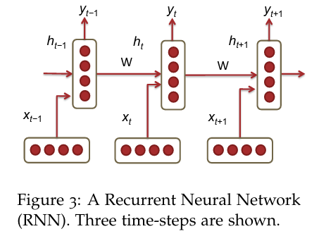
Each vertical rectangular box is a hidden layer at a time-step $t$. 
$$
h_t=\sigma(W^{(hh)}h_{t-1}+W^{(hx)}x_t)
$$
$$
\hat{y}_t=softmax(W^{(S)}h_t)
$$
The parameter in the network
* $x_1,...,x_{t-1},x_t,x_{t+1},...,x_T$: the word vectors corresponding to a corpus with T words.
* $h_t=\sigma(W^{(hh)}h_{t-1} + W^{(hx)}x_t)$
* $\hat{y}_t=softmax(W^{(S)}h_t)$
只需要训练共用的权重$W^{（hh）},W^{(hx)}$

### RNN Loss and Perplexity
loss at time-step t
$$
J^{(t)}(\theta)=-\sum_{j=1}^{|V|}y_{t,j}\times log(\hat{y}_{t,j})
$$
So the cross entropy erros over a corpus of size $T$ is:
$$
J = \frac{1}{T}\sum_{t=1}^TJ^{(t)}(\theta)=-\frac{1}{T}\sum_{t=1}^T\sum_{j=1}^{|V|}y_{t,j} \times log(\hat{y}_{t,j})
$$
***Perplexity***
$$
Perplexity=2^J
$$

### Drawbacks of RNN
1. Computation is slow, can not be parallelized
2. Difficult to access information from many steps back(vanishing and exploding gradients)

### Vanishing Gradient & Gradient Explosion Problems
$$
\frac{\partial E}{\partial W}=\sum_{t=1}^T\frac{\partial E_t}{\partial W}
$$
the corresponding differentiation of $W$ is
$$
\frac{\partial E_t}{\partial W} = \sum_{k=1}^t \frac{\partial E_t}{\partial y_t} \frac{\partial y_t}{\partial h_t} \frac{\partial h_t}{\partial h_k} \frac{\partial h_k}{\partial W}
$$
链式法则求导即可
the relationship to compute each $dh_t/dh_k$
$$
\frac{\partial h_t}{\partial h_k}= \prod_{j=k+1}^t \frac{\partial h_j}{\partial h_{j-1}}=\prod_{j=k+1}^{t}W^T \times diag[f'(j_{j-1})]
$$
so
$$
\frac{\partial E}{\partial W} =\sum_{t=1}^T \sum_{k=1}^t \frac{\partial E_t}{\partial y_t} \frac{\partial y_t}{\partial h_t} \frac{\partial h_t}{\partial h_k} \frac{\partial h_k}{\partial W}
\\=\sum_{t=1}^T\sum_{k=1}^t \frac{\partial E_t}{\partial y_t} \frac{\partial y_t}{\partial h_t} (\prod_{j=k+1}^t \frac{\partial h_j}{\partial h_{j-1}}) \frac{\partial h_k}{\partial W}
$$
the norm of the Jacobian matrix relationship,($\beta_W\ and\ \beta_h$ represent the upper bound values fro the two matrix norms)
$$
||\frac{\partial h_j}{\partial h_{j-1}}|| \leq ||W^T||\ ||diag[f'(h_{j-1})]|| \leq \beta_W \beta_h
$$
the norm of $\frac{\partial h_t}{\partial h_{k}}$
$$
||\frac{\partial h_t}{\partial h_{k}}||=||\prod_{j=k+1}^t \frac{\partial h_j} {\partial h_{j-1}}||\leq (\beta_W \beta_h)^{t-k}
$$

### Solution to the Exploding & Vanishing Gradient
***clip*** gradients to a small number whenever they explode.
* $\hat{g} \leftarrow \frac{\partial E}{\partial W}$
* if ||$\hat{g} \geq threshold$|| then
    * $\hat{g} \geq \frac{threshold}{||\hat{g}||} \hat{g}$
* end if

The second way is to use **RELU**

### Deep Bidirectional RNNs

$$
\overrightarrow{h}_t=f(\overrightarrow{W}x_t + \overrightarrow{V}\overrightarrow{h}_{t-1}+\overrightarrow{b})
\\ \overleftarrow{h}_t = f(\overleftarrow{W}x_t + \overleftarrow{V}\overleftarrow{h}_{h+1} + \overleftarrow{b})
\\ \hat{y}_t = g(Uh_t+c) = g(U[\overrightarrow{h}_t;\overleftarrow{h}_t]+c)
$$
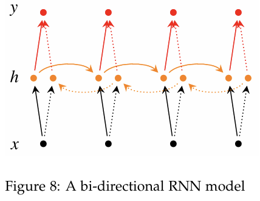
RNN can also be multi-layered.
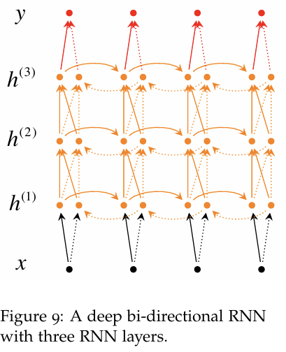
$$
\overrightarrow{h}_t^{(i)}=f(\overrightarrow{W}^{(i)}h_t^{(i-1)} + \overrightarrow{V}^{(i)}\overrightarrow{h}_{t-1}^{(i)}+\overrightarrow{b}^{(i)})
\\ \overleftarrow{h}_t^{(i)} = f(\overleftarrow{W}^{(i)}h_t^{(i-1)} + \overleftarrow{V}^{(i)}\overleftarrow{h}_{h+1}^{(i)} + \overleftarrow{b}^{(i)})
\\ \hat{y}_t = g(Uh_t+c) = g(U[\overrightarrow{h}_t^{(L)};\overleftarrow{h}_t^{(L)}+c)
$$

### Application: RNN Translation Model
The first hidden layer time-steps ***encode*** the German language words into features(h3). The last two time-steps ***decode*** h3 into English word outputs.
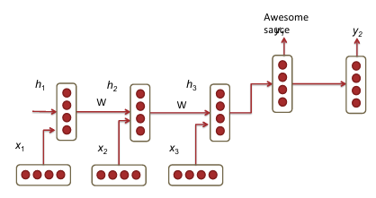

encoder
$$
h_t = \phi(h_{t-1},x_t) = f(W^{(hh)}h_{t-1}+W^{(hx)}x_t)
$$
decoder
$$
h_t = \phi(h_{t-1}) = f(W^{(hh)}h_{t-1})
$$
$$
y_t=softmax(W^{(S)}h_t)
$$

Extension1: train different RNN weights fro encoding and decoding
Extension2: compute every hidden state in the decoder using three different input
* previous hidden state
* Last hidden layer of the encoder
* Previous predicted output word, $\hat{y}_{t-1}$
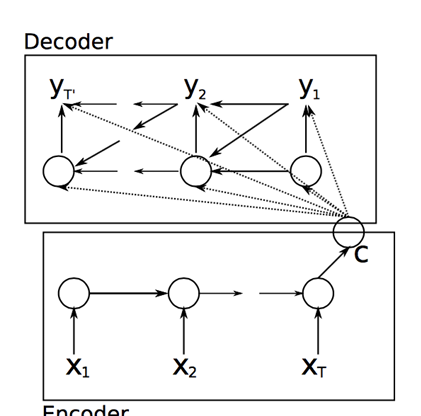
* Extension3: using multiple RNN layers
* Extension4: bi-directional encoder
* Extension5: revering the order of the input words

## Gated Recurrent Units(GRU)
$$
z_t=\sigma(W^{(z)}x_t+U^{(z)}h_{t-1})\ \ (Update\ gate)
\\ r_t=\sigma(W^{(r)}x_t+U^{(r)}h_{t-1})\ \ (Rest\ gate)
\\ \tilde{h}_t=tanh(r_t \circ Uh_{t-1}+Wx_t)
\\ h_t=(1-z_t) \circ\tilde{h}_t+z_t\circ h_{t-1}
$$
1. New memory generation: $\tilde{h}_t$
2. Reset Gate: $r_t$ is responsible for determining how importanct $h_{t-1}$ is to the summarization $\tilde{h}_t$
3. Update Gate: $z_t$ is responsible for determining how much of $h_{t-1}$ should be carried forward to the next state.
4. Hidden state: $h_t$
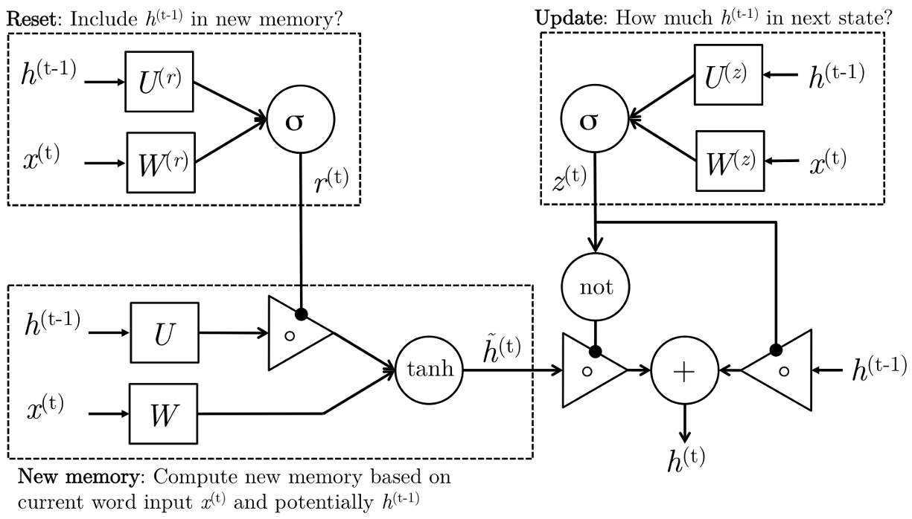

## Long-Short-Term-Memories
$$
\dot{i}_t = \sigma(W^{(i)}x_t+U^{(i)}h_{t-1})\ (Input\ gate)
\\ f_t = \sigma(W^{(f)}x_t+U^{(f)}h_{t-1})\ (Forget\ gate)
\\ o_t=\sigma(W^{(o)}x_t+U^{(o)}h_{t-1})\ (Output/Exposure\ gate)
\\ \tilde{c}_t=tanh(W^{(c)}x_t+U^{(c)}h_{t-1})\ (New\ memory\ cell)
\\ c_t = f_t\circ c_{t-1} + \dot{i}_t \circ \tilde{c}_t\ (Final\ memory\ cell)
\\ h_t = o_t \circ tanh(c_t)
$$
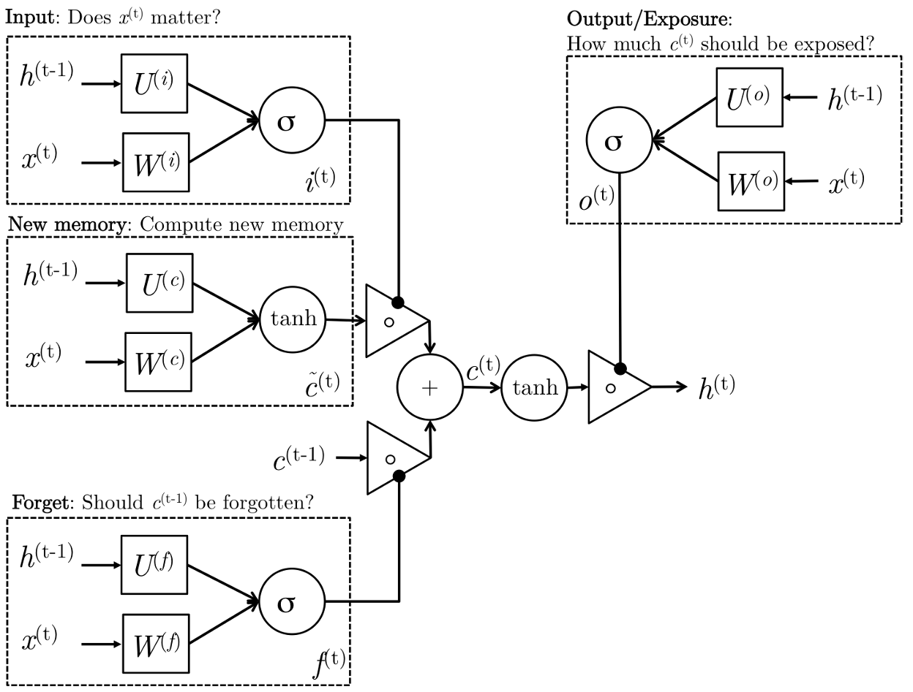
1. New memory generation
2. decide whether or not the input is worth preserving
3. decide whether or not the past memory cell is useful
4. takes the advice of the forget gate $f_t$ and accordingly forgets the past memory $c_{t-1}$. and takes the advice of the input gate $\dot{i}_t$ and accordingly gates the new memory $\tilde{c}_t$
5. Output/Exposure Gate: decide what parts of the memory $c_t$ need to be exposed/present in the hidden state $h_t$

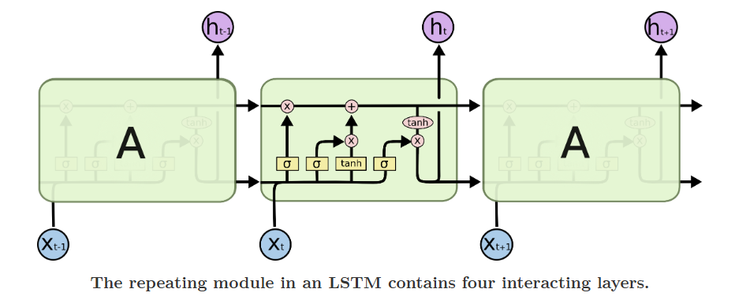
上面那从cell中出来的线就是memory $c_t$，下面从cell种出来的线是 $h_t$，首先计算新记忆的重要度$\dot{i}^{(t)}$和新记忆$\tilde{c}^{(t)}$。计算旧记忆的重要度，hadamard乘积后相加得到最终的记忆 $c_t$. 之后计算output cell产生的$o_t$，之后用hadamard乘积生成$h_t$

The key to LSTMs is the cell state, the horizontal line running through the top of the diagram.

# Self-Attention & Transformers

## Neural architectures and their properties
### Notation and basics
Transformer Encoder-Decoder
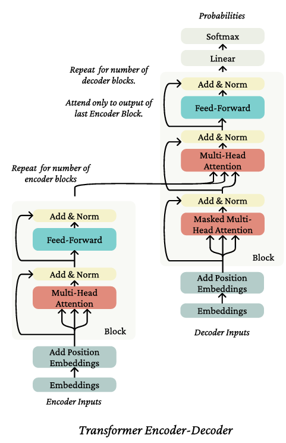
$w_{1:n}$ is a sequence, where each $w_i \in V$, a finite vocabulary. Also aoverload $w_{1:n}$ to be a matrix of ont-hot vectors, $w_{1:n} \in R^{n \times |V|}$.
$$
w_t \sim softmax(f(w_{1:t-1}))
$$
means that under a model, $w_t$ is drawn from the probability distribution defined by the right-hand-side of the tilde.

If A is a tensor of shape $R^{l,d}$, the softmax is computed as follows:
$$
softmax(A)_{i,j}=\frac{expA_{i,j}}{\sum_{j'==1}^d expA_{i,j'}}
$$
softmax is defined over the last dimension.

Embedding matrix $E \in R^{d\times |V|}$ maps from the vocabulary space to the ***hidden dimensionality*** d, written as $Ex \in R^d$

**non-contextual embedding**: embedding independent of context.
**contextual embedding**: embedding depend on the context.

### recurrent neural networks
1. **Parallelization issues with dependence on the sequence index** can not compute parallelly
2. **Linear interaction distance** difficulty with which distant tokens in a sequence can **interact** with each other.

## A minimal self-attention architecture
Attention is a method for taking a query, and softly looking up information in a key-value store by picking the values of the keys most like the query.

We can develop contextual representation using attention mechanism.

### The key-query-value self-attention mechanism
define query $q_i = Qx_i$, for matrix $Q \in R^{d \times d}$. key $k_j = Kx_j$, value $v_j = Vx_j$ for $K \in R^{d\times d}$ and $V \in R^{d\times d}$

contextual representtion $h_i$ of $x_i$ is a linear combination of the values of the sequence
$$
h_i = \sum_{j=1}^n \alpha_{ij}v_j
$$
the $\alpha_{ij}$ softly selects what data to look up. Difine these weights by computing the affinities between the keys and the query, $q_i^Tk_j$, and then computing the softmax over the sequence
$$
\alpha_{ij}=\frac{exp(q_i^Tk_j)}{\sum^n_{j'=1}exp(q_i^Tk_{j'})}
$$
this operation is take element $x_i$ and look in its own sequence $x_{1:n}$ to figure out what information, from what other tokens, should be used in representing $x_i$ in context.
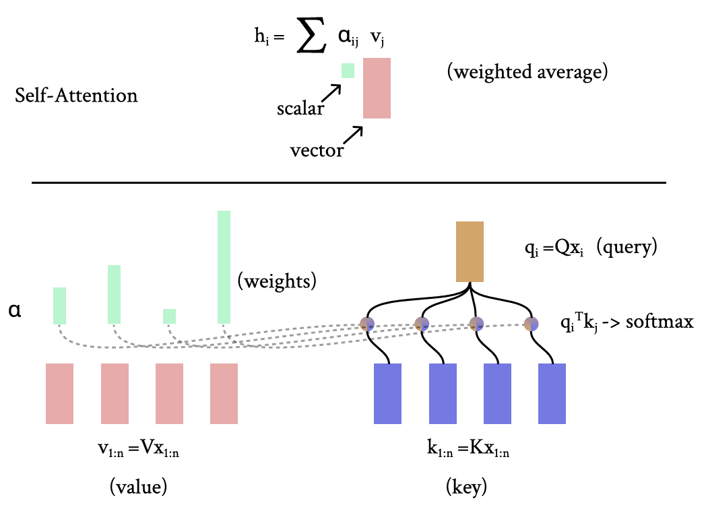

### Position representations
The representation of $x$ is not position-dependent if we just use attention mechanism.

To represent position 
1. use vectors that are already position-dependent as input
2. change the self-attention operation itself.

***Position representation through position embedding***
posit a new parameter matrix $P \in R^{N \times d}$, N is the ***maximum length of any sequence*** that model will be able to process.
Then add embedded representtation of the position of a word to its word embedding
$$
\tilde{x}_i = P_i + x_i
$$
and preform self-attention as we otherwise would.

***Position representation through changing a directly***
self-attention should look at "nearby" words than "far" words. Linear Biases attention
$$
\alpha_i = softmax(k_{1:n}q_i+[-i,...,-1,0,-1,...,-(n-i)])
$$
where $k_{1:n}q_i \in R^n$ are the original attention scores.

### Elementwise nonlinearity
if just stack two self-attention layers, we just get something that looks a lot like a single self-attention layer
$$
\begin{align}
o_i =& \sum_{j=1}^n \alpha_{ij}V^{(2)}(\sum_{k=1}^nV^{(1)}x_k)
\\ =& \sum_{k=1}^n \alpha^*_{ij}V^*x_k
\end{align}
$$
$\alpha_{ij}^* = (\alpha_{jk}\sum_{j=1}^n \alpha_{ij})$, and $V^* = V^{(2)}V^{(1)}$. So the combination of a linear transformation of the input is just like a single layer of self-attention.

So in practice, after a layer of self-attention, it's common to apply feed-forward network independently to each word representation
$$
h_{FF}=W_2RELU(W_1h_{self-attention} + b_1) + b_2
$$
where often, $W_1 \in R^{5d \times d}$, and $W_2 \in R^{d \times 5d}$. The hidden dimension of the feed-forward network is substantially larger than the hidden dimentsion of the netword, d. This is because this matrix multiply is an efficiently parallelizable operation, so it's an efficient place to put a lot of computation and parameters.
...这真的有用吗？

### Future masking
In RNNs
$$
w_t \sim softmax(h_{t-1}E)
\\ h_{t-1} = \sigma(Wh_{t-1}+Ux_{t-1})
$$
we predict a word given all words so far, haven't looked at the future.

So in a Transformer, enfore this constraint by adding a large negative constant to the input to the softmax(将i之后的$q_i^T k_j,\ j>i$设置为一个足够大的负数). or setting $\alpha_{ij}=0,\ where j>i$
$$
\alpha_{ij,masked}=\left\{ 
\begin{align}
\alpha_{ij}\ j \leq i 
\\ 0\ otherwise
\end{align}
\right\}
$$

### Summary of a minimal self-attention architecture
1. self-attentio operation
2. position representation
3. elementwise nonlinearities
4. future masking(in language model)
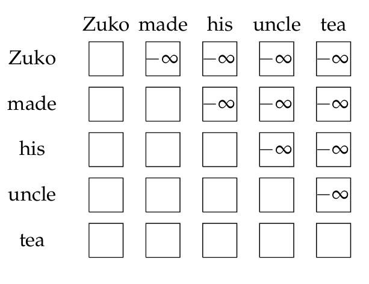
This is the Diagram of autoregressive future masking in self-attention. Words in each row have words in the future masked out

## The Transformer
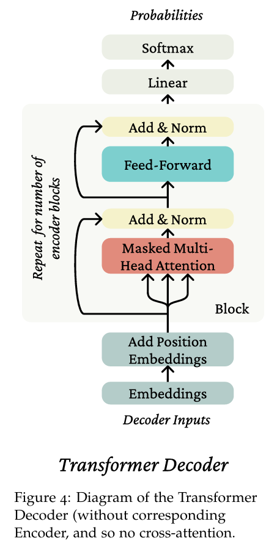
Diagram of the Transformer Decoder

Transformer is an architecture based on self-attention that consists of stacked ***Blocks***, each of which contains self-attention and feedforward layers.

### Multi-head Self-Attention
For an integer number of heads $k$, define $k^{(l)},Q^{(l)},V^{(l)}\in R^{d\times d/ k}$ for $l$ in ${1,...,k}$. Correspondingly, we get keys, queries, and values $k_{1:n}^{(l)},q_{1:n}^{(l)},v_{1:n}^{(l)})$

perform self-attention with each head
$$
\begin{align}
h_i^{(l)}=\sum_{j=1}^n \alpha_{ij}^{(l)}v_j^{(l)}
\\ \alpha_{ij}^{(l)} = \frac{exp(q_i^{(l)T}k_j^{(l)})}{\sum_{j'=1}^n exp(q_i^{(l)T}k_{j'}^{(l)})}
\end{align}
$$
Finally, define the output of multi-head self-attention as a linear transformation of the concatenation of the head outputs, letting $O \in R^{d\times d}$
$$
h_i =O [ v_i^{(1)};...;v_i^{(k)} ]
$$
concatenate the head outputs each of dimensionality $d\times d/k$ at second axis, such that their concatenation has dimension $d\times d$

***Sequence-tensor form***
**multi-head self-attention is no more expensive than single-head** due to the low-rankness of the transformations.

For a **single head**, $x_{1:n}$ is a matrix in $R^{n \times d}$. Value matrix $x_{1:n}V$, key matrix $x_{1:n}K$, and query matrix $x_{1:n}Q$, all matrices in $R^{n\times d}$
compute self-attention in matrix operations
$$
\alpha = softmax(x_{1:n}QK^Tx_{1:n}^T)\ \in R^{n\times n}
$$
then compute the self-attention operation for $x_{1:n}$ via:
$$
h_{1:n} = softmax(x_{1:n}QK^Tx_{1:n}^T)x_{1:n}V\ \in R^{n \times d}
$$
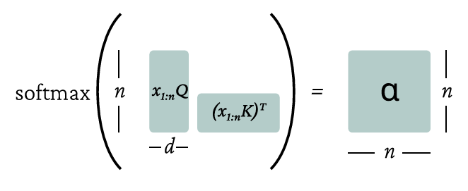
diagram of matrix ops

For **multi-head** self-attention in matrix form
1. reshape $x_{1:n}Q,x_{1:n}K,and\ x_{1:n}V$ each into a matrix shape $R^{n,k,d/k}$
2. transpose the matrices to $R^{k,n,d/k}$, this allows us to perform the batched softmax operation in parallel across the heads, using the number of heads kind of like a **batch** axis.
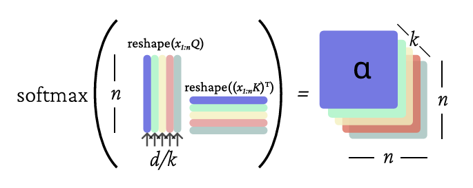
多头注意力机制和单头一模一样，就是多叠了几层（类似于batch）。可以并行计算。

### Layer Norm
The intuition of **layer normalization** is to reduce uninformative variation in the activations at a layer, providing a more stable input to the next layer. But further work shows that this may be most useful not in normalizing the forward pass, but actually in improving gradients in the backward pass.

1. computes statistics across the activations at a layer to estimate the mean and variance of the activations
2. normalizes the activations with respect to those estimates

In transformers, the statistics are computed independently for a single index into the sequence length and shared across the $d$ hidden dimensions.

we compute the statistics for a single index $i\in {1,...,n}$ as
$$
\hat{\mu}=\frac{1}{d}\sum_{j=1}^d h_{ij}
\\ \hat{\sigma}_i=\sqrt{\frac{1}{d}\sum_{j=1}^d(h_{ij}-\mu_{i})^2}
$$
layer norm
$$
LN(h_i)=\frac{h_i-\hat{\mu}_i}{\hat{\sigma}_i}
$$

### Residual Connections
Residual connections simply add the **input** of a layer to the **output** of that layer
$$
f_{residual}(h_{1:n})=f(h_{1:n})+h_{1:n}
$$
the intuition is that 
1. the gradient flow of the identity function is 1 everywhere. So the connection allows for learning much deeper networks.
2. it is easier to learn the difference of a function from the identity function than it is to learn the function from scratch.

使用残差块有两个原因，

第一个是因为$\frac{f_{residual}}(h_{1:n})$关于$h_{1:n}$的导数是identity matrix。所以可以将Loss关于$\frac{f_{residual}}(h_{1:n})$很好地,直接地，传播到input上，而不是通过output进行传播。

第二个是因为要学习f函数，可能通过学习input和output之间的差距(f(input)-f)，比直接学习f(input)更容易

***Add & Norm*** layer normalization and residual connection are often combined in a single bisual block labeled ***Add & Norm***.
$$
h_{pre-norm}=f(LN(h)) + h
$$
$f$ is a feed-forward operation or a self-attention operation, this is known as ***pre-normalization***, or like:
$$
h_{post-norm}=LN(f(h)+h)
$$
this is known as ***post-normalization***. The gradients of **pre-normalization** are much better at initialization, leading to much faster training.

### Attention logit scaling
**scaled dot product attention** when the dimensionality $d$ of the vectors grows large, the dot product of even random vectors grows roughly as $\sqrt{d}$. So, normalize the dot products by $\sqrt{d}$
$$
\alpha = softmax(\frac{x_{1:n}QK^Tx_{1:n}^T}{})
$$

### Transformer Encoder
A Encoder takes a single sequence $w_{1:n}$, and performs no future masking. 1. embeds the sequence with $E$ to make $x_{1:n}$
2. adds the position representation
3. applies a stack of independently parameterized ***Encoder Block***(consisting 1. multi-head attention and And & Norm 2. feed-forward and Add & Norm)
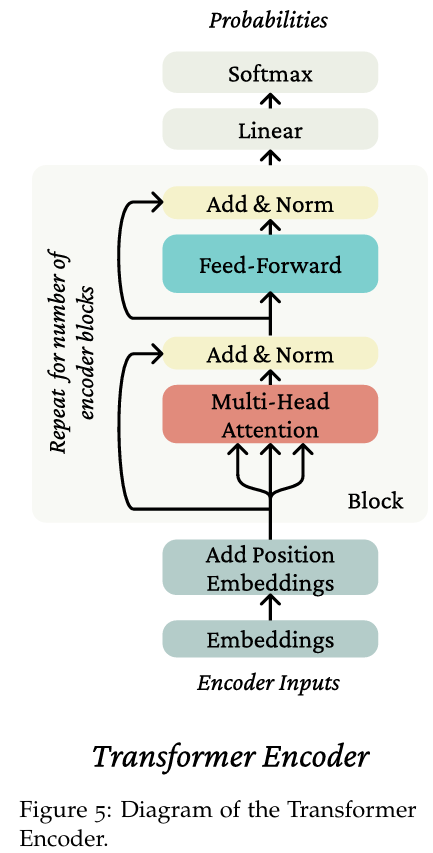

applies a linear transformation to the output space followed by a softmax, in the case that one wants probabilities out of tokens.

***Uses of the Transformer Encoder*** Transformer Encoder without future masking is performs well in contexts where you are not trying to genetate text autoregressively, and want strong representations for the whole sequence.

### Transformer Decoder
differ from Transformer Encoder by using future masking at each application of self-attention.

### Transformer Encoder-Decoder
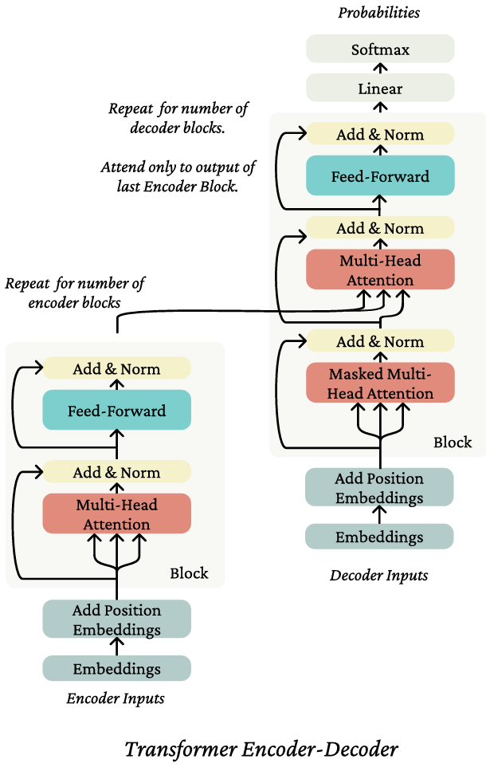
Transformer encoder-decoder takes as input two sequences. 

$x_{1:n}$ is passed through a Transfomer Encoder to build contextual representations. 

The second sequence $y_{1:m}$ is encoded through a modified Transformer Decoder architecture in which **cross-attention** is applied from the encoded representation of $y_{1:m}$ to the output of the Encoder.

***Cross-Attention*** uses one sequence to define the keys and values of self-attention, and another sequence to define the queries.
$$
h_{1:n}^{(x)}=TransformerEncoder(w_{1:n})
$$
some intermediate representation $h^{(y)}$ of sequence $y_{1:m}$, let the queries come from the decoder while the keys and values come from the encoder
$$
q_i = Qh_i^{(y)}\ i\in {1,...,m}
k_j = Kh_j^{(x)}\ j\in {1,...,n}
v_j = Vh_j^{(x)}\ j\in {1,...,n}
$$

## More information about the Transformer
output of the top encoder is transformed into a set of attention vectors K and V. These are to be used by each decoder in its cross-attentio layer which helps the decoder focus on appropriate places in the input sequence.

The following steps repeat the process until a special symbol is reached indicating the transformer decoder has completed its output. The output of each step is fed to the bottom decoder in the next time step.

最初第一个time step输出了第一个单词I
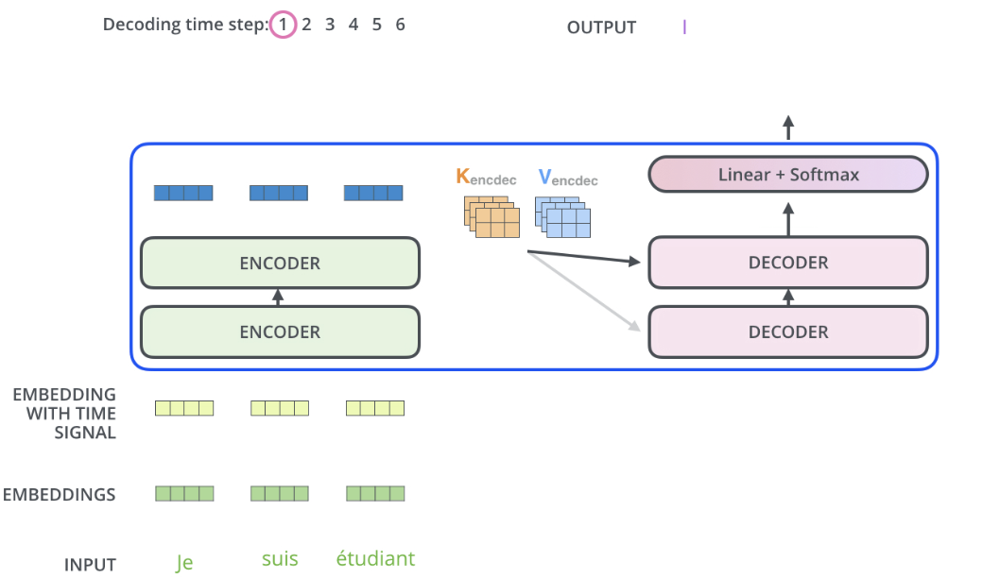
接着第二个time step用第一次输出的I作为decoder的输入接着生成第二个单词am
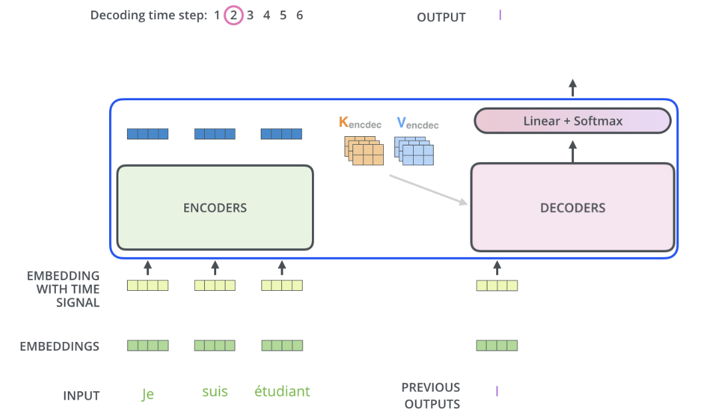
继续下去，直到生成代表结束的token
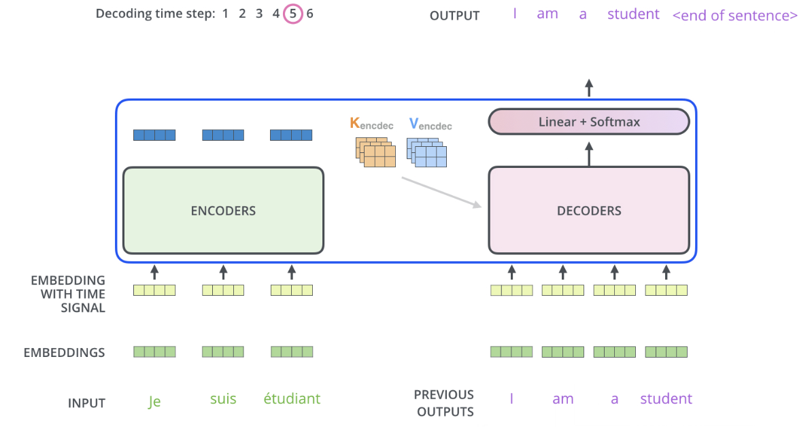

in the decoder, the self-attention layer is also masked to allow it to attend to earlier positions in the output sequence.

## Language Model
### Head

Head means the additional neural we add on top of the basic transformer architecture to enable that task.

The job of language modeling head is to take the output of the final transformer layer from the last token N and use it to predict the upcoming word at position N+1
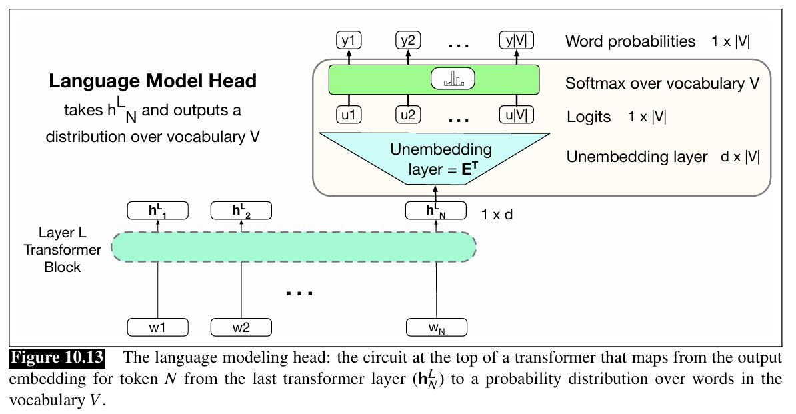

This linear layer projecting output $h_N^l$ to logits can be learned, but more commonly tie this matrix to (the transpose of) the embedding matrix **E**.

At the input stage of the tansformer the embedding matrix (of shape [|V] $\times$ d) is used to map to an embedding. In the language model head, $E^T$, the transpose of the embedding matrix is used to map back from an embedding to a vector over the vocabulay.
这里因为相似程度用内积进行计算，所以用了$E^T$。在最后的输出阶段用$h_N^LE^T$相当于用$h_N^L$去与$E$的每个列向量计算相似度。最后其实和attention一样。

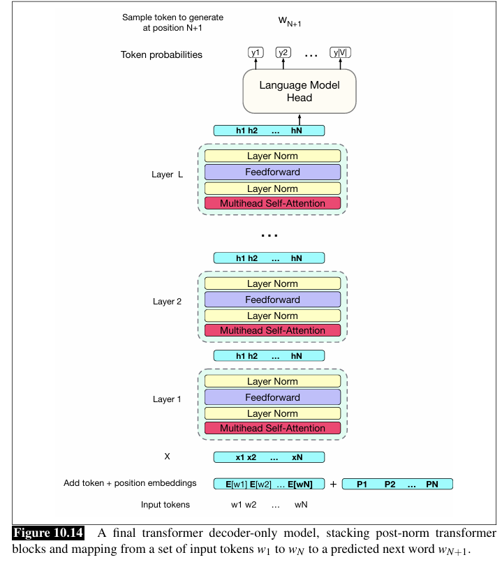
This is a decoder-only model mapping from a set of input tokens $w_1$ to $w_N$ to a predicted next word $W_{N+1}$

Another useful feature of the unembedding layer: a tool for interpretability of the internals of the transformer that we call the **logit lens**. We can take a vector from any layer of the transformer and multiply it by the unembedding layer to get logits, and compute a softmax to see the distribution over words.