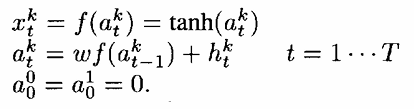
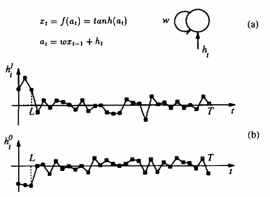
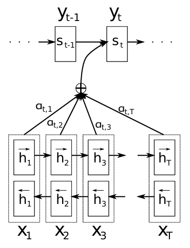
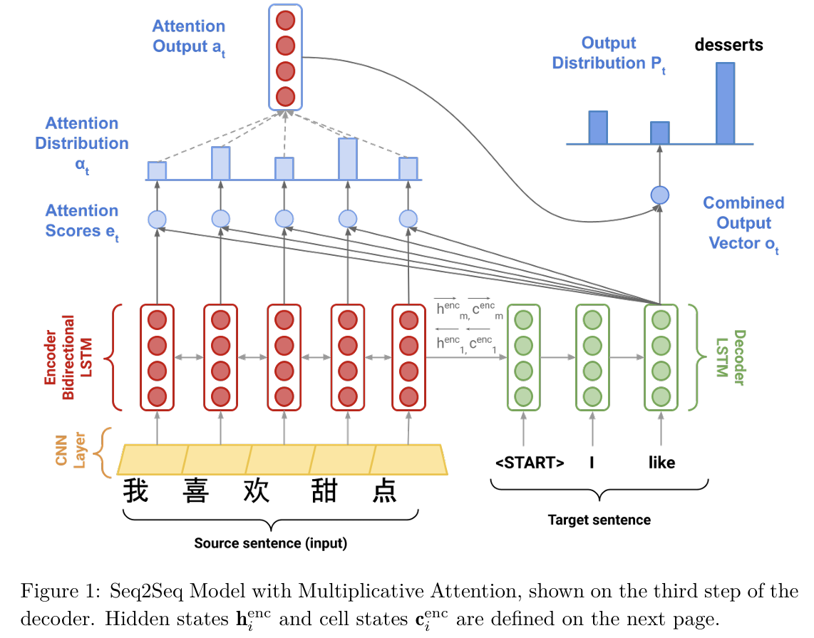
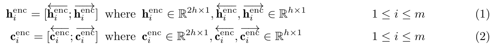
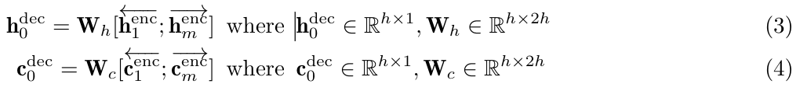
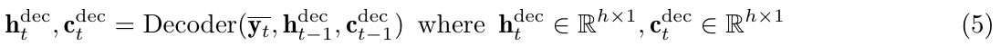
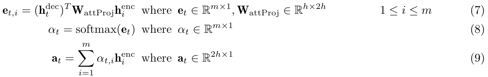
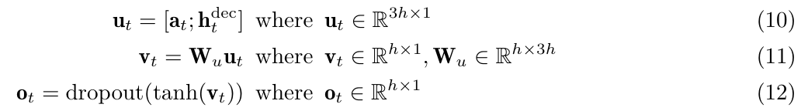

# A gentle introduction to matrix calculus

## Tools
### Trace
### Linear and quadratic forms
1. $Ax = 0 \ for\ every\ x \Leftrightarrow A=0$
2. $x'Ax=0\ for\ every\ x \Leftrightarrow A\ is\ skew-symmetric$
3. $x'Ax=0\ for\ every\ x\ and\ A=A' \Leftrightarrow A=0$
### The Kronecker product
$$
\left(
\begin{matrix}
a_11B & ... & a_{1n}B
\\ ... & ... & ...
\\a_{m1}B & ... & a_{mn}B
\end{matrix}
\right)
$$
is called the ***Kronecker product*** of A and B and is written as $A \otimes B$

The following three propertie:
$$
\begin{align}
(A\otimes B)\otimes C &= A \otimes (B \otimes C)
\\(A + B) \otimes (C + D) &= A \otimes C + A \otimes D + B \otimes C + B \otimes D
\\(A \otimes B)(C \otimes D) &= AC \otimes BD
\end{align}
$$

We have
$$
\begin{align}
(A \otimes B)' &= A' \otimes B'
\\tr(A \otimes B) &= (trA)(trB)
\\(A \otimes B)^{-1} &= A^{-1} \otimes B^{-1}
\end{align}
$$

### The vec operator
$$
vec A = 
\left(
\begin{matrix}
1 & 2 & 3
\\4 & 5 & 6
\end{matrix}
\right)
$$
$$
vec A =(1 ,4, 2, 5, 5, 6)'
$$

Proposition. If A and B are matrices of the same order, then
$$
(vecA)'(vecB) = trA'B
$$

# Learning Long-Term Dependencies with Gradient Desent is Diffcult
parametric dynamical system that can learn to store relevant state information
1. the system is able to store information for an arbitrary duration
2. the system is resistant to noise
3. the system parameters is trainable 

***information latching***:long-term storage of definite bits of information into the state variables of the dynamic system is refferred to as 

## Minimal Task Illustrating The Problem
A parametric system is trained to classify two different sets of sequences of length T. The class of $C(\mu_1,...,\mu_T)$ = $C(\mu_1,...,\mu_L)$, which means the class only depends on the first $L$ values.

In order to train a module feeding the latching subsystem, the learning algorithm should be able to transmit error information to such a module. So, whether the learning algorithm can propagate error information to a module that feed the latching subsystem?

The initial inputs $h_t$, for $t \leq L$ are values which can be ***tuned by the learning algorithm*** whereas $h_t$ is Gaussian noise for $L<t\leq T$. The connection weights of the test system are also trainable parameters. Loss
$$
C=\frac{1}{2}\sum_p(x^p_T-d^p)^2
$$

$p$ is an index over the training sequence, and $d^p$ is a target of +0.8 for sequence of class 1 and -0.8 for sequences of class 0.

In this formulation, $h_t,(t=1,...,L)$ represent the result of the computation that extracts the class information.
这个任务就是，分辨一个由前几个元素决定种类的序列的类别。通过一个参数序列$\{h_t\}$进行预测，但是只能训练这个参数序列的前几个元素。

## Simple Recurrent Network Candidate solution
Two types of classes$(k=0, k=1)$

If $w>1\ and\ f'(0)=1$, then the dynamic of this neuron has two attractors $\overline{x}>0\ and\ -\overline{x}$ that depend on the value of the weight $w$.(intersections of the curve $x=tanh(a)$ with the line $x=a/w$)
两个特征 $\overline{x}$ 和 $-\overline{x}$ ,是$x=tanh(a)$和直线$x=\frac{a}{w}$的交叉点

Assuming that the initial state at $t=0$ is $x_0=-\overline{x}$, exists a value $h^*>0$ of the input such that 
1) $x_t$ maintains its sign if $|h_t|<h^* \forall t$
2) and there exists a finite number of step $L_1$ such that $x_{L1}>\overline{x}$ if $h_t > h^* \forall t \leq L_1$. For a fixed $w$, the transient length $L_1$ decreases with $|h_t|$

如果input很大，那么信息存储时间就会很长，如果input很小，那么input不能改变神经元的符号。

# Sequence to Sequence Learning with Neural Networks
LSTM-LM
$$
p(y_1,...,y_{T'}|x_1,...,x_T)=\prod_{t=1}^{T'}p(y_t|v,y_1,...,y_{t-1})
$$

1. two different LSTMs: one for input sequence, another for the output sequence(can train the LSTM on multiple language pairs simultaneously)
2. four layer LSTM
3. reverse the order of the words of the input sentence(instead of mapping the sentence $a,b,c$ to the sentence $\alpha, \beta, \gamma$, the LSTM maps $c, b, a$ to $\alpha, \beta, \gamma$)

## Comment
经典Seq2Seq结构，用一个hidden vector来编码输入encoder中的句子的信息，然后用decoder生成目标句子。

# Neural Machine Translation By Jointly Learning To Align And Translate
Using of a fixed-length vector is a bottleneck in improving the performance of encoder-decoder architecture.
Propose to extend this model by allowing a model to automatically search for parts of a source that are relevant to predicting  target word.

## Learning To Align And Translate
Bidirectional RNN as an encoder, and a decoder that emulates searching through a source sentence during decoding a translation.
### Decoder
$$
p(y_i|y_1,...,y_{i-1},X) = g(y_{i-1},s_i,c_i)
$$
$s_i$ is an RNN hidden state for time $i$, computed by
$$
s_i = f(s_{i-1}, y_{i-1}, c_i)
$$
the probability is conditioned on a distinct context vector $c_i$ for each target word $y_i$

The context vector $c_i$ depends on a sequence of ***annotations*** $(h_1,...,h_{T_x})$ to which an encoder maps the input sentence. Each annotation $h_i$ contains information about the whole input sequence with a strong focus on the parts surrounding the $i-th$ word of the input sequence.

The context vector $c_i$ is computed as a weighted sum of these annotations $h_i$
$$
c_i = \sum_{j=1}^{T_x} \alpha_{ij}h_j
$$

The weight $\alpha_{ij}$ of each annotation $h_j$ is computed by 
$$
\alpha_{ij}=\frac{exp(e_{ij})}{\sum_{k=1}^{T_x}exp(e_{ik})}
$$
where
$$
e_{ij}=a(s_{i-1}, h_j)
$$
is an ***alignment model*** which scores how well the inputs around position $j$ and the output at position $i$ match. The score is based on the RNN hidden state $s_{i-1}$ and the $j-$th annotation $h_j$ of the input sentence.
parametrize the alignment model a as a feedforward neural network.
The alignment model directly computes a soft alignment, which allows the gradient of the cost function to be backpropagated through. This gradient can be used to train the alignment model as well as the whole translation model jointly.
同时训练对其模型和整个translation model

 We can understand the approach of taking a weighted sum of all the annotations as computing an expected annotation, where the expectation is over possible alignments. Let $\alpha_{ij}$ be a probability that the target word $y_{i}$ is aligned to, or translated from, a source word $x_j$. Then, the i-th context vector $c_i$ is the expected annotation over all the annotations with probabilities ij.

 The probability $\alpha_{ij}$ reflects the importance of the annotation $h_j$ with respect to the previous hidden state $s_{i-1}$ in deciding the next state $s_i$ and generating $y_i$

## Comment
1. 相较于Seq2Seq，encoder部分没有改变，利用隐向量表示句子的信息，在decoder部分加上了attention mechanism用来获取除了隐向量之外的句子信息（例如决定当前需要翻译的这个单词更依赖于原有句子中的哪个部分）

# Assignment
## Asignment3
### Neural Machine Translation with RNN

Bidirectional LSTM Encoder and a Unidirectional LSTM Decoder.

1. look up the word embeddings from an **embedding matrix**, yielding $x_1, ..., x_m\ (x_i \in R^{(e\times1)})$
生成embedding
2. feed the embedding to a **convolutional layer**
将embedding用卷积网络处理
3. feed the convolutional layer outputs to the **bidirectional encoder**
encoder是一个双向LSTM
4. forwards and backwards hidden states are concatenated to give hidden states $h_i^{enc}$ and cell states $c_i^{enc}$
最终的隐藏状态$h_i$是前向的隐藏状态和后向的隐藏状态的拼接

5. initialize the **decoder's** first hidden state $h_0^{dec}$ and cell state $c_0^{dec}$ with a linear projection of the encoder's final hidden state and final cell state
将decoder的第一个隐藏状态$h_0^{dec}$和记忆cell state$c_0^{dec}$用encoder最后hidden state和final cell state初始化

6. with the decoder initialized. On $t^{th}$ step, look up the embedding for $t^{th}$ subword, $y_t \in R^{e\times 1}$. then concatenate $y_t$ with the **combined-output** vector $o_{t-1} \in R^{h\times 1}$. The firest target subword $O_0$ is a zero-vector. Then feed $\overline{y_t}$ as input to the decoder
初始化之后将target sentence feed到decoder中。 在第t步的时候，寻找第t步的subword的embedding（yt）并将这个embedding与t-1步的***combined-output***拼接来生成$\overline{y}_t \in R^{(e+h)\times 1}$. 第一个目标subword $o_0$是一个零向量

7. then use $h_t^{dec}$ to compute multiplicative attention over $h_1^{enc},...,h_m^{enc}$
最后用$h_t^{dec}$来计算在$h_1^{enc},...,h_,^{enc}$上面的注意力

公式很好理解，先用一个线性层，将encoder的hidden state从2h映射到h，接着使用内积来计算t-th step的隐藏状态$h_t^{dec}$与每个encoder的hidden state ($h_i^{enc}$)的相似性。接着用softmax将相似性归一化。最后生成$a_t$。
8. concatenate the attention output $a_t$ with the decoder hidden state $h_t^{dec}$ and pass this through a linear layer, tanh, and dropout to attain the ***combined-output*** vector $o_t$.
用attention拼接encoder中hidden state产生的信息与目前decoder的hidden state进行拼接，之后经过线性层，非线性激活层，dropout来获得***combined-output***（最终的结果）

9. Then, we produce a probability distribution $P_t$ over target subwords at the $t^{th}$ timestep:
$$
P_t = softmax(W_{vocab}o_t)\ where P_t \in R^{V_t \times 1}, W_{vocab} \in R^{V_t \times h}
$$
loss, $g_t$ is the ont-hot vector of the target subword at timestep t
$$
J_t(\theta) = CrossEntropy(P_t, g_t)
$$
