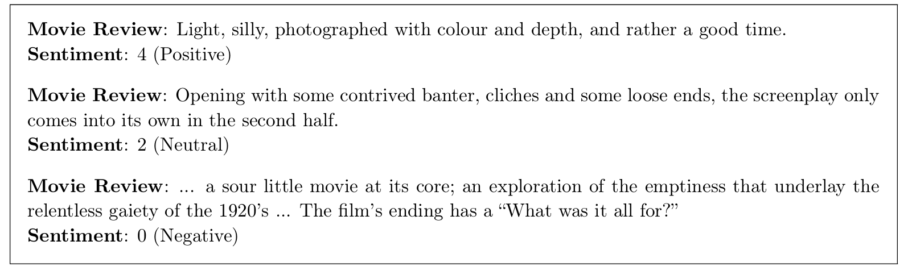
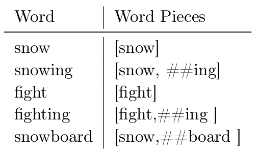
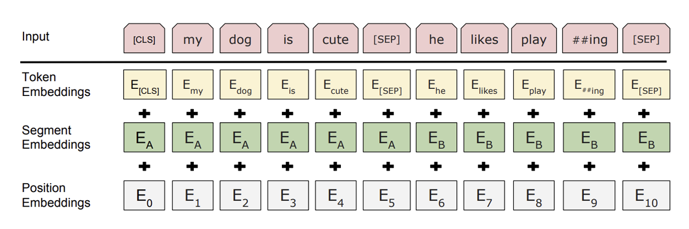
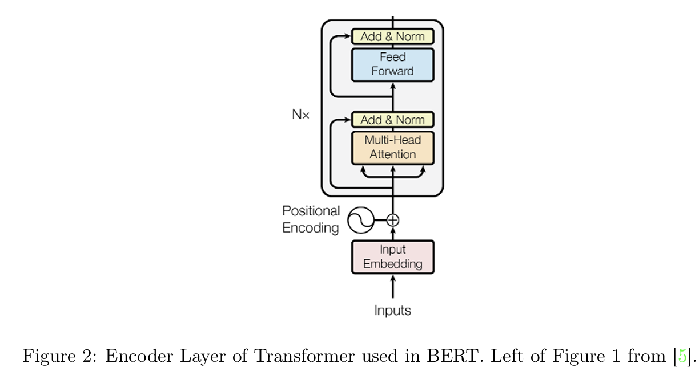

# Final Project

1. Fill in missing code blocks to complete an implementation of the BERT model. Using pre-trained weights loaded into Bert Model, perform sentiment analysis on the SST dataset and the CFIMDB dataset.
2. Explore extensions of BERT to **sentiment analysis**, **paraphrase detection**, **semantic textual similarity**

## 1. Overview

### 1.2 Sentiment Analysis(SST)

Stanford Sentiment Treebank(SST). The dataset was parsed with the Stanford parser. Each phrase has a label of negative, somewhat negative, neutral, somewhat positive, or positive.

### 1.3 Paraphrase Dectection(Quora)

The task of finding paraphrases of texts in a large corpus of passages, seeks to determine whether particular words or phrases convey the same semantic meaning.

Quora dataset is a dataset that labels whether different questions are paraphrases of each other.

### 1.4 Semantic Textual Similarity (STS)(SEM)

This task seeks to capture the notion that some texts are more similar than others, seeks to measure the degree of semantic equivalence.  STS differs from paraphrasing in that it is not a yes or no decision. Rather, STS allows for degrees of similarity. e.g on a scale from 0 to 5

### 1.5 About Proj

1. implement the BERT
2. extend BERT to a wide range of downstreamtasks
3. serveral tech used to create more robust and semantically-rich sentence embeddings in BERT models

- Files with missing code blocks to be completed for Part1

  - `bert.py`
  - `classifier.py` A classifire pipeline for running sentiment analysis
  - `optimizer.py` Adam Optimizer

- Files central to Part2

  - `multitask_classifire.py`
  - `datasets.py` Functions and classes that load data for the three downstream tasks
  - `evaluation.py` Functions that evaluate an input model on the three downstream tasks.

## 3. Implementing minBERT

### 3.1 Details of BERT

**Tokenization(tokenizer.py)**

**WordPiece**: predefined set of 30K different word pieces

Each input sentence is padded to a given **max_length**(512) with the [PAD] token. First token of BERT's hidden state is used as the embedding for the entire sentence([CLS] token)

Use [SEP] token to introduce an artificial separation between two input sentences.

**Embedding Layer**(bert.BertModel.embed)

The input embedding that are used in later portions of BERT are the sum of

1. the token embeddings
2. the segmentation embeddings (The learnable segmentation embeddings are used to differentiate between sentence types)
3. the position embedding

Each embedding layer has 768 dimensions.

**BERT Transformer Layer(bert.BertLayer)**

12 Encoder Transformer layers.

**Multi-head attention**

$$
Attention_i(h_j) = \sum_t softmax(\frac{W^q_ih_j \cdot W_i^k h_t}{\sqrt{d/n}})W_i^vh_t
$$

In BERT $W_i^q, \ W_i^k,\ W_i^b$are matrices of size $d/n \times d$

$$
MH(h)=W^o[Attention_1(h),...,Attention_n(h)]
$$

$$
h' = LN(h+MH(h))\\
SA(h) = FFN(h')
$$

$LN(\cdot)$is layer normalisation. FFN is a standard feed-forward network

$$
FFN(h) = W_2f(W_1h + b_1) + b_2
$$

$f(\cdot)$ is a non-linearity, GeLU in BERT.

**Dropout**

applies dropout to the output of each sub-layer, before it is added to the sub-layer input and normalized. $p_{drop} = 0.1$

**BERT output**(bert.BertModel.forward)

1. `last_hidden_state`: the contextualized embedding for each word piece of the sentence from the last BertLayer
2. `pooler_output`: the [CLS] token embedding

**Training BERT**

two unsupervised tasks on Wikipedia articles

1. **Masked Language Modeling**

   Mask 15% of the word piece tokens and attempts to predict them. The final hidden vectors of the masked tokens are fed into an output softmax layer. Training data generator choose 15% of the token positions at random for prediction; 80% of the chosen tokens are replaced with [MASK], 10% of the tokens are replaced with a random token, 10% remain unchanged.

2. **Next Sentence Prediction**

   BERT is shown a sentence and its next sentence 50% of time; for the other 50% of the time, it is shown a random second sentence. The BERT model predicts whether the second input sentence is actually the next sentence.

### 3.2 Code To be Implemented: Multi-head Self-attention and the Transformer Layer

1. `bert.BertSelfAttention.attention`
2. `bert.BertLayer` and `bert.BertModel`

