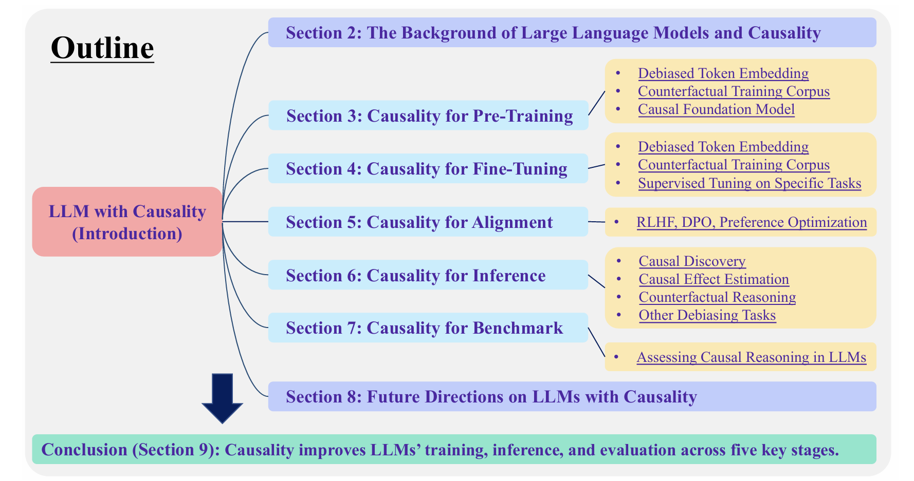
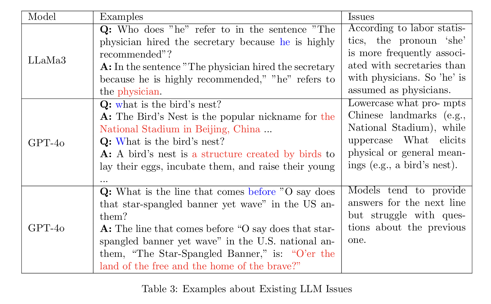

# Causality for Large Language Models
LLMs still rely on probabilistic modeling, which often captures spurious correlations rooted in linguistic patterns and social steretypes, rather than the true causal relationships between entities and events.

How causality can enhance LLMs at every stage of their lifecycle-form token embedding learning and foundation model training to finetuning, alignment, inference and evaluation.

## Introduction
Causality helps models
1. move beyond superficial correlations, enabling them to generate more reliable and interpretable outputs.
2. improve fairness by allowing models to account for confounding factors and systemic biases present in the data, producing more ethically aligned predictions. 
3. enhance the ability of models to handle complex tasks where understanding the causal relationships is critical.
4. allow LLMs to preform counterfactual reasoning.

Challages in the incorporation of causal reasoning into LLMs
1. **Dependence on Unstructured Text Data (Requires Causal Embedding)**: LLMs are trained on unstructured text data that primarily conveys correlations rather than explicit causal knowledge.
2. **Challanges in Understanding Counterfactuals (Requires Counterfactual Corpus)**: 
Causal reasoning often involves evaluating counterfactual scenarios. 
3. **Limitations of Transformer-based Model (Requires Causal Foundational Model)**: 
Transformer is designed to capture interactions between words by attending to various parts of the input text.
4. **Causal Blindness in Pre-trained Models (Requires Causal SFT)**: Pre-trained LLMs are not ingerently designed to prioritize or detect causal relationships during their initial training. 

## The Background of LLM and Causality
### Limitations of LLMs

1. **Gender discrimination**: 'she' is more frequently associated with secretaries than with physicians.
2. **Unstable response**:
3. **Causual**: provide answers for the next line but struggle with questions about the previous one.

## Causality for Pre-training

## Causaliry for Fine-Tuning

## Causality for Alignment

## Causality for Inference

## Causality for Benchmark

## Future Directions on LLMs with Causality

## Consclusion