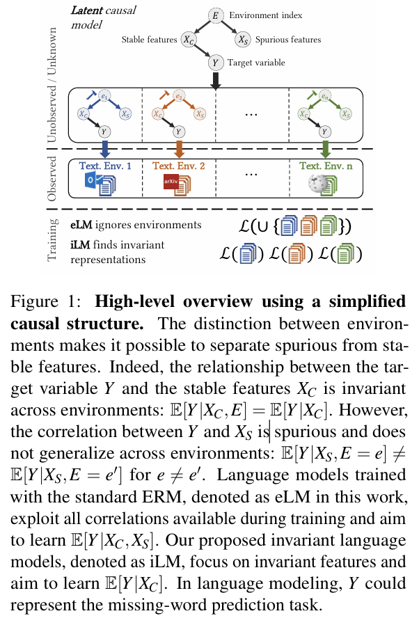

# Causality for Large Language Models
LLMs still rely on probabilistic modeling, which often captures spurious correlations rooted in linguistic patterns and social steretypes, rather than the true causal relationships between entities and events.

How causality can enhance LLMs at every stage of their lifecycle-form token embedding learning and foundation model training to finetuning, alignment, inference and evaluation.

## Introduction
Causality helps models
1. move beyond superficial correlations, enabling them to generate more reliable and interpretable outputs.
2. improve fairness by allowing models to account for confounding factors and systemic biases present in the data, producing more ethically aligned predictions. 
3. enhance the ability of models to handle complex tasks where understanding the causal relationships is critical.
4. allow LLMs to preform counterfactual reasoning.

Challages in the incorporation of causal reasoning into LLMs
1. **Dependence on Unstructured Text Data (Requires Causal Embedding)**: LLMs are trained on unstructured text data that primarily conveys correlations rather than explicit causal knowledge.
2. **Challanges in Understanding Counterfactuals (Requires Counterfactual Corpus)**: 
Causal reasoning often involves evaluating counterfactual scenarios. 
3. **Limitations of Transformer-based Model (Requires Causal Foundational Model)**: 
Transformer is designed to capture interactions between words by attending to various parts of the input text.
4. **Causal Blindness in Pre-trained Models (Requires Causal SFT)**: Pre-trained LLMs are not ingerently designed to prioritize or detect causal relationships during their initial training. 

## The Background of LLM and Causality
### Limitations of LLMs

1. **Gender discrimination**: 'she' is more frequently associated with secretaries than with physicians.
2. **Unstable response**:
3. **Causual**: provide answers for the next line but struggle with questions about the previous one.

## Causality for Pre-training

## Causaliry for Fine-Tuning

## Causality for Alignment

## Causality for Inference

## Causality for Benchmark

## Future Directions on LLMs with Causality

## Consclusion

# BERT: Pre-training of Deep Bidirectional Transformers for Language Understanding

# Causal-Debias: Unifying Debiasing in Pretrained Language Models and Fine-tuning via Causal Invariant Learning

Causal-Debias mitigates bias from a causal invariant prespective by leveraging the specific downstream task to identify bias-relevant and lablel-relevant factors.  
Bias-relevant factors are non-causal as they should have little impact on downstream tasks, while label-relevant factors are causal.

Introduce SCM to PLM debiasing to discover the inherent causal relations between data and lablels.

## Related Works
(1) ***Non-Task-Specific***
(2) ***Task-Specific***

[Lipstick on a Pig: Debiasing Methods Cover up Systematic Gender Biases in Word Embedding But do not Remove Them](https://aclanthology.org/N19-1061/)
[An empirical survey of the effectiveness of debiasing techniques for pre-trained language models](https://aclanthology.org/2022.acl-long.132/)

**Causal Mechanism**: Invariant Risk Minimization(IRM) is an optimization objective modifying the loss with a regularization term to enforce the invariant representations.

## Methodeology
Unify debiasing with downstream fine-tuning. Mitigate language model bias ***during*** fine-tuning process.

### Biases from a Causal View

Whether a factor is a causal or non-causal depends on the specific downstream tasks. In sentiment classification task, causal factors could be "good", "bad". In coreference resolution task(共指消解), pronouns could be causal factors while adjective words could be non-causal.

Only $X$ and $Y$ are observed during the fine-tuning, while neither the causal factor $C$ nor the mapping from $C$ to $Y$ is available. Factorize the LM as a combination of two modules $M = m_Y \circ m_C$ where $m_C: X \to C$ discover the causal factor from the observed $X$, and $m_Y: C \to Y$ outputs the prediction $Y$. 

ERM heabily relies on the statisticall dependency between the input sentences and labels, ignoring the critical condition $Y \perp\!\!\!\perp N|C$ to guarantee the invariant causal association $C \to Y$ across different $N$.

IRM encourages causal factor $C$ to seek the patterns that are stable across different "enviornments", while abandoning the unstable non-causal patterns. 
$$
min_{m_C,m_Y}R(m_Y \circ m_C(X), Y),s.t. Y \perp\!\!\!\perp N|C
$$

IRM often leverages multiple "enviornments" to facilitate causal learning. [Invariant language modeling](https://aclanthology.org/2022.emnlp-main.387/) uses prior knowledge to partition the training set to form different environments. But how to construct multiple "environments" in the context of LM fine-tuning is less studied.

### 3.2 Causal-Debias
**Causal Intervention**
$W_a$ and $W_t$ denote ***attribute*** words and ***target*** words. 
e.g.
Gender bias,
target words consist of gender-neutral words(***nurse, engineer, professor***)
attribute words are composed of the feminine(***she, woman, mother***) and masculine words(***he, man, father***)
The augmented datasets $X_d$:
$$
X_d = X_o \cup X_c
$$
create counterfactual sentences by replacing the attribute word to its corresponding pair (e.g., he->she)

Debiasing performance degradation problems. To create sufficiently complex interventional distributions and obtain the most different demographic group.

Conduct the interventions by doing semantic matching between $X_d$ with external corpora $E$, expanding $X_o$ and $X_c$ to $X_{\tilde{o}}$ and $X_{\tilde{c}}$
$$
X_{\tilde{d}} = X_{\tilde{o}} \cup X_{\tilde{c}} = Top_k(sim(X_d, E))\cup X_d
$$

Then reconstruct the interventional distribution by combining $X_{\tilde{d}}$ and the rest bias-unrelated downstream dataset.

# Invariant Language Modeling
**invariant language model** using invariant risk minimization(IRM).
Adapt a game-theoretic formulation of IRM(IRM-games) to languages models, where the invariance emerges from a  specific training schedule in which all the environment specific loss by updating subsets of the model in a round-robin fashion.
