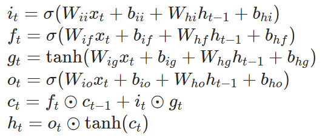
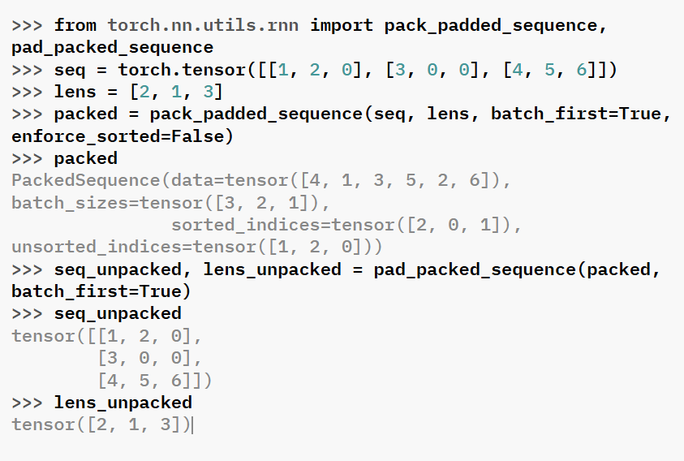

# nn

## nn.ModuleList(modules=None)

`ModuleList` can be indexed like a regular Python list

**Parameters**

**modules**(iterable, optional)-an iterable of modules to add

**Example**:

```python
class MyModule(nn.Module):
    def __init__(self)-> None:
        super().__init__()
        self.linears = nn.ModuleList([nn.Linear(10, 10) for i in range(10)])
    
    def forward(self, x):
        for i, l in enumerate(self.linears):
            x = self.linears[i//2](x) + l(x)
        return x
```

**append**(module)  
Append a given module to the end of the list.

**extend**(modules)  
Append modules from a Python iterable to the end of the list.

**insert**(index, module)  
Insert a given module before a given index in the list.

## nn.Embedding

```python
class torch.nn.Embedding(num_embeddings,
 embedding_dim, 
 padding_idx=None, 
 max_norm=None, 
 norm_type=2.0, 
 scale_grad_by_freq=False, 
 sparse=False, 
 _weight=None, 
 _freeze=False, 
 device=None, 
 dtype=None)
```

### Parameters

- `padding_idx(int, optional)` if specified, the entries at `padding_idx` do not contribute to the gradient. therefore, the embedding vector at padding_idx is not updated during training, i.e. it remains as a fixed “pad”. For a newly constructed Embedding, the embedding vector at padding_idx will default to all zeros, but can be updated to another value to be used as the padding vector.  
  位于`padding_idx`位置的embedding不参与更新，并且在新建Embedding时，位于`padding_idx`的向量会背设置为零向量
- `max_norm(float, optional)` if given, each embedding vector with norm larger than `max_norm` is renormalized to have norm `max_norm`  
  这个参数会限制embedding vector的norm
- `norm_type(float, optional)` The `p` of the p-norm to compute the `max_norm` option. Default `2`
- `scale_grad_by_freq(bool, optional)` If given, this will scale gradient by the inverse of frequency of the words in the mini-batch. Default `False`
- `sparse(bool, optional)` If `True`, gradient w.r.t `weight` matrix will be a sparse tensor.

### Variables

**weight(Tensot)** -the learnable weights of the module of shape (num_embeddings, embedding_dim) initialized from $N(0, 1)$

- Input(*), IntTensor or LongTensor of arbitrary shape containing the indices to extract
- Output(*, H), where * is the input shape and $H = embedding_dim$

**Note**  
when `max_norm` is not `None`, `Embedding's` forward method will modify the `weight` tensor in-place. Since tensors needed for gradient computations can not be modified in-place, performing a differentiable operation on `Embedding.weight` before calling `Embedding's` forward mehod requires cloning `Embedding.weight` when `max_norm` is not `None`  
如果在修改之前试图对`embedding.weight`执行某些可以微分的操作(`@`)，那么无法为这些操作的参数计算梯度。所以要想使`embedding.weight`参与某些可微分计算，并且正确地得到梯度，必须在操作之后，且在`backward`之前不能使用`forward()`。如果使用`forward`会对本来的`embedding.weight`进行修改，从而导致pytorch追踪不到最初的weight。

## nn.Conv1d

```python
class torch.nn.Conv1d(in_channels,
    out_channels,
    kernel_size,
    stride=1,
    padding=0,
    dilation=1,
    groups=1,
    bias=True,
    padding_mode='zeros',
    device=None,
    dtype=None
    )
```

output value of the layer with input size $(N, C_{in}, L)$ and output $(N, C_{out}, L_{out})$ can be precisely described as

$$
out(N_i, C_{out_j}) = bias(C_{out_j}) + \sum_{k=0}^{C_{in}-1}weight(C_{out_j}, k) * input(N_i, k)
$$

The shape of input is (batch_size, num_channels, length), and the kernel move along the last dimension.

```python
m = nn.Conv1d(16, 33, 3, stride=2)
input = torch.randn(20, 16, 50)
output = m(input)
```

## nn.LSTM

```python
class torch.nn.LSTM(input_size,
    hidden_layer,
    num_layers=1,
    bias=True,
    batch_first=False,
    dropout=0.0,
    bidirectional=False,
    proj_size=0,
    device=None,
    dtype=None
    )
```

Each layer computes the following function  




  
$i_t, f_t, g_t, o_t$ is the input, forget, cell, and output gates, repectively. $\sigma$ is the sigmoid function, $\odot$ is the hadamard product.

In a multilayer LSTM, the input $x_t^{(l)}$ of the $l-th$ layer($l \geq 2$) is the hidden state $h_t^{(l-1)}$ of the previous layer multiplied by **dropout** $\delta_t^{(l-1)}$ where each $\delta_t^{l-1}$ is a Bernoulli random variable which is 0 with probability `dropout`  
多层LSTM已经包含了dropout

- `num_layers` Number of recurrent layers. The current layer would take the output of the previous layer as input.
- `bias` if `False` The layer does not use bias `b_in` and `b_hh`
- `batch_first` If `True` the input and output tensor are provided as (batch, seq, feature) instead of (seq, batch, freature). Ths does not apply to hidden or cell states.
- **input**: tensor of shape $(L, H_{in})$ for unbatched input, $(L, N, H_{in})$ when `batch_first=False` or $(N,L,H_{in})$ when `batch_first=True`
- **h_0**: tensor of shape $(D*num_layers, H_{out})$ for unbatched input or $(D*num_layers,N,H_{out})$ containing the initial hidden state for each element in the input sequence. Defaults to zeros
- **c_0**: tensor of shape $(D*num_layersm,H_{cell})$ for unbatched input or $(D*num_layers,N,H_{cell})$ containg the initial cell state for each element in the input sequence.  
  一个序列会产生一组隐藏状态，因此使用batch进行训练的时候初始的隐藏状态会有N组$h_0,c_0$
- **output**: tensor of shape $(L, D*H_{out})$ for unbatched input, $(L,N,D*H_{out})$ when `batch_first=False`, $N,L,D*H_{out}$ when `batch_first=True`
- **h_n**: tensor of shape $(D*num_layers, H_{out})$ for unbatched input or $(D*num_layers, N, H_{out})$. When `bidirectional=True`, $h_n$ will contain a concatenation of the final forward and reverse hidden states, respectively.
- **c_n**: tensor of shape $(D*num_layers, H_{cell})$ for unbatched input or $(D*num_layers, N, H_{cell})$. When `bidirectional=True`, $c_n$ will contain a concatenation of the final forward and reverse cell states, respectively.

**Variables**

- **weight_ih_l[k]** the learnable input-hidden weights of $k^{th}$ layer. $(W_{ii},W_{if},W_{ig},W_{io})$ of shape (4*hidden_size, input_size) for k = o. Otherwise, the shape is (4*hidden_size, num_directions*hidden_size)
- **weight_hh_l[k]** the learnable hidden-hidden weights for the $k^{th}$ layer $(W_{hi},W_{hf},W_{hg},W_{ho})$, of shape (4*hidden_size, hidden_size).
- **bias_ih_l[k]** the learnable input-hidden bias of the $k^{th}$ layer $(b_{ii},b_{if},b_{hg},b_{io})$ of shape (4*hidden_size)
- **bias_hh_l[k]** the learnable hidden-hidden bias of the $k^{th}$ layer $(b_{hi},b_{hf},b_{hg},b_{ho})$ of shape (4*hidden_size)
- **weight_ih_l[k]_reverse** when `bidirectional=True`
- **weight_hh_l[k]_reverse**
- **bias_ih_l[k]_reverse**
- **bias_hh_l[k]_reverse**

```python
rnn = nn.LSTM(10, 20, 2)
input = torch.randn(5, 3, 10)
h0 = torch.randn(2, 3, 20)
c0 = torch.randn(2, 3, 20)
output, (hn, cn) = rnn(input, (h0, c0))
```

## nn.LSTMCell

```python
class torch.nn.LSTMCell(input_size,
    hidden_size,
    bias=True,
    device=None,
    dtype=None
    )
```

```python
rnn = nn.LSTMCell(10, 20)  # (input_size, hidden_size)
input = torch.randn(2, 3, 10)  # (time_steps, batch, input_size)
hx = torch.randn(3, 20)  # (batch, hidden_size)
cx = torch.randn(3, 20)
output = []
for i in range(input.size()[0]):
    hx, cx = rnn(input[i], (hx, cx))
    output.append(hx)
output = torch.stack(output, dim=0)
```

## nn.utils

### rnn

#### rnn.pack_padded_sequence

```python
torch.nn.utils.rnn.pack_padded_sequence(input,
    lengths,
    batch_first=False,
    enforce_sorted=True
    )
```

Packs a Tensor containing padded sequences of variable length.  
`input` can be of size $T \times B \times *$ if(`batch_first` is `False`) or $B \times T \times *$(if `batch_first` is `True`) where `T` is the length of the longest sequence, `B` is the batch size, and `*` is any number of dimensions

For unsorted sequences, use `enforce_sorted = False`. If `enforce_sorted` is True, the sequences should be sorted by length in a decreasing order, i.e. input[:,0] should be the longest sequence, and input[:,B-1] the shortest one. enforce_sorted = True is only necessary for ONNX export.

#### rnn.pad_packed_sequence

```python
torch.nn.utils.rnn.pad_packed_sequence(sequence,
    batch_first=False,
    padding_value=0.0,
    total_length=None
    )
```

pad a packed batch of variable length sequences

It is an inverse operation ot `pack_padded_sequence()`

The returned Tensor’s data will be of size T x B x * (if batch_first is False) or B x T x * (if batch_first is True) , where T is the length of the longest sequence and B is the batch size.

```python
from torch.nn.utils.rnn import pack_padded_sequence, pad_packed_sequence
seq = torch.tensor([[1, 2, 0], [3, 0, 0], [4, 5, 6]])
lens = [2, 1, 3]
packed = pack_padded_sequence(seq, lens, batch_first=True, enforce_sorted=False)
packed
seq_unpacked, lens_unpacked = pad_packed_sequence(packed, batch_first=True)
seq_unpacked
lens_unpacked
```



## nn.Dropout

```python
class torch.nn.Dropout(p=0.5, inplace=False)
```

During training, randomly zeroes some of the elements of the input tensor with probability `p`  
The zeroed elements are chosen independently for each forward call and are sampled from a Bernoulli distribution.  
Each channel will be zeroed out independently on every forward call.

**Source code for torch.nn.modules.dropout**

```py
import torch.nn.functional as F
from torch import Tensor

from .module import Module


__all__ = [
    "Dropout",
    "Dropout1d",
    "Dropout2d",
    "Dropout3d",
    "AlphaDropout",
    "FeatureAlphaDropout",
]


class _DropoutNd(Module):
    __constants__ = ["p", "inplace"]
    p: float
    inplace: bool

    def __init__(self, p: float = 0.5, inplace: bool = False) -> None:
        super().__init__()
        if p < 0 or p > 1:
            raise ValueError(
                f"dropout probability has to be between 0 and 1, but got {p}"
            )
        self.p = p
        self.inplace = inplace

    def extra_repr(self) -> str:
        return f"p={self.p}, inplace={self.inplace}"


[docs]class Dropout(_DropoutNd):
    r"""During training, randomly zeroes some of the elements of the input tensor with probability :attr:`p`.

    The zeroed elements are chosen independently for each forward call and are sampled from a Bernoulli distribution.

    Each channel will be zeroed out independently on every forward call.

    This has proven to be an effective technique for regularization and
    preventing the co-adaptation of neurons as described in the paper
    `Improving neural networks by preventing co-adaptation of feature
    detectors`_ .

    Furthermore, the outputs are scaled by a factor of :math:`\frac{1}{1-p}` during
    training. This means that during evaluation the module simply computes an
    identity function.

    Args:
        p: probability of an element to be zeroed. Default: 0.5
        inplace: If set to ``True``, will do this operation in-place. Default: ``False``

    Shape:
        - Input: :math:`(*)`. Input can be of any shape
        - Output: :math:`(*)`. Output is of the same shape as input

    Examples::

        >>> m = nn.Dropout(p=0.2)
        >>> input = torch.randn(20, 16)
        >>> output = m(input)

    .. _Improving neural networks by preventing co-adaptation of feature
        detectors: https://arxiv.org/abs/1207.0580
    """

    def forward(self, input: Tensor) -> Tensor:
        return F.dropout(input, self.p, self.training, self.inplace)


[docs]class Dropout1d(_DropoutNd):
    r"""Randomly zero out entire channels.

    A channel is a 1D feature map,
    e.g., the :math:`j`-th channel of the :math:`i`-th sample in the
    batched input is a 1D tensor :math:`\text{input}[i, j]`.

    Each channel will be zeroed out independently on every forward call with
    probability :attr:`p` using samples from a Bernoulli distribution.

    Usually the input comes from :class:`nn.Conv1d` modules.

    As described in the paper
    `Efficient Object Localization Using Convolutional Networks`_ ,
    if adjacent pixels within feature maps are strongly correlated
    (as is normally the case in early convolution layers) then i.i.d. dropout
    will not regularize the activations and will otherwise just result
    in an effective learning rate decrease.

    In this case, :func:`nn.Dropout1d` will help promote independence between
    feature maps and should be used instead.

    Args:
        p (float, optional): probability of an element to be zero-ed.
        inplace (bool, optional): If set to ``True``, will do this operation
            in-place

    Shape:
        - Input: :math:`(N, C, L)` or :math:`(C, L)`.
        - Output: :math:`(N, C, L)` or :math:`(C, L)` (same shape as input).

    Examples::

        >>> m = nn.Dropout1d(p=0.2)
        >>> input = torch.randn(20, 16, 32)
        >>> output = m(input)

    .. _Efficient Object Localization Using Convolutional Networks:
       https://arxiv.org/abs/1411.4280
    """

    def forward(self, input: Tensor) -> Tensor:
        return F.dropout1d(input, self.p, self.training, self.inplace)


[docs]class Dropout2d(_DropoutNd):
    r"""Randomly zero out entire channels.

    A channel is a 2D feature map,
    e.g., the :math:`j`-th channel of the :math:`i`-th sample in the
    batched input is a 2D tensor :math:`\text{input}[i, j]`.

    Each channel will be zeroed out independently on every forward call with
    probability :attr:`p` using samples from a Bernoulli distribution.

    Usually the input comes from :class:`nn.Conv2d` modules.

    As described in the paper
    `Efficient Object Localization Using Convolutional Networks`_ ,
    if adjacent pixels within feature maps are strongly correlated
    (as is normally the case in early convolution layers) then i.i.d. dropout
    will not regularize the activations and will otherwise just result
    in an effective learning rate decrease.

    In this case, :func:`nn.Dropout2d` will help promote independence between
    feature maps and should be used instead.

    Args:
        p (float, optional): probability of an element to be zero-ed.
        inplace (bool, optional): If set to ``True``, will do this operation
            in-place

    .. warning ::
        Due to historical reasons, this class will perform 1D channel-wise dropout
        for 3D inputs (as done by :class:`nn.Dropout1d`). Thus, it currently does NOT
        support inputs without a batch dimension of shape :math:`(C, H, W)`. This
        behavior will change in a future release to interpret 3D inputs as no-batch-dim
        inputs. To maintain the old behavior, switch to :class:`nn.Dropout1d`.

    Shape:
        - Input: :math:`(N, C, H, W)` or :math:`(N, C, L)`.
        - Output: :math:`(N, C, H, W)` or :math:`(N, C, L)` (same shape as input).

    Examples::

        >>> m = nn.Dropout2d(p=0.2)
        >>> input = torch.randn(20, 16, 32, 32)
        >>> output = m(input)

    .. _Efficient Object Localization Using Convolutional Networks:
       https://arxiv.org/abs/1411.4280
    """

    def forward(self, input: Tensor) -> Tensor:
        return F.dropout2d(input, self.p, self.training, self.inplace)


[docs]class Dropout3d(_DropoutNd):
    r"""Randomly zero out entire channels.

    A channel is a 3D feature map,
    e.g., the :math:`j`-th channel of the :math:`i`-th sample in the
    batched input is a 3D tensor :math:`\text{input}[i, j]`.

    Each channel will be zeroed out independently on every forward call with
    probability :attr:`p` using samples from a Bernoulli distribution.

    Usually the input comes from :class:`nn.Conv3d` modules.

    As described in the paper
    `Efficient Object Localization Using Convolutional Networks`_ ,
    if adjacent pixels within feature maps are strongly correlated
    (as is normally the case in early convolution layers) then i.i.d. dropout
    will not regularize the activations and will otherwise just result
    in an effective learning rate decrease.

    In this case, :func:`nn.Dropout3d` will help promote independence between
    feature maps and should be used instead.

    Args:
        p (float, optional): probability of an element to be zeroed.
        inplace (bool, optional): If set to ``True``, will do this operation
            in-place

    Shape:
        - Input: :math:`(N, C, D, H, W)` or :math:`(C, D, H, W)`.
        - Output: :math:`(N, C, D, H, W)` or :math:`(C, D, H, W)` (same shape as input).

    Examples::

        >>> m = nn.Dropout3d(p=0.2)
        >>> input = torch.randn(20, 16, 4, 32, 32)
        >>> output = m(input)

    .. _Efficient Object Localization Using Convolutional Networks:
       https://arxiv.org/abs/1411.4280
    """

    def forward(self, input: Tensor) -> Tensor:
        return F.dropout3d(input, self.p, self.training, self.inplace)


[docs]class AlphaDropout(_DropoutNd):
    r"""Applies Alpha Dropout over the input.

    Alpha Dropout is a type of Dropout that maintains the self-normalizing
    property.
    For an input with zero mean and unit standard deviation, the output of
    Alpha Dropout maintains the original mean and standard deviation of the
    input.
    Alpha Dropout goes hand-in-hand with SELU activation function, which ensures
    that the outputs have zero mean and unit standard deviation.

    During training, it randomly masks some of the elements of the input
    tensor with probability *p* using samples from a bernoulli distribution.
    The elements to masked are randomized on every forward call, and scaled
    and shifted to maintain zero mean and unit standard deviation.

    During evaluation the module simply computes an identity function.

    More details can be found in the paper `Self-Normalizing Neural Networks`_ .

    Args:
        p (float): probability of an element to be dropped. Default: 0.5
        inplace (bool, optional): If set to ``True``, will do this operation
            in-place

    Shape:
        - Input: :math:`(*)`. Input can be of any shape
        - Output: :math:`(*)`. Output is of the same shape as input

    Examples::

        >>> m = nn.AlphaDropout(p=0.2)
        >>> input = torch.randn(20, 16)
        >>> output = m(input)

    .. _Self-Normalizing Neural Networks: https://arxiv.org/abs/1706.02515
    """

    def forward(self, input: Tensor) -> Tensor:
        return F.alpha_dropout(input, self.p, self.training)


[docs]class FeatureAlphaDropout(_DropoutNd):
    r"""Randomly masks out entire channels.

    A channel is a feature map,
    e.g. the :math:`j`-th channel of the :math:`i`-th sample in the batch input
    is a tensor :math:`\text{input}[i, j]` of the input tensor). Instead of
    setting activations to zero, as in regular Dropout, the activations are set
    to the negative saturation value of the SELU activation function. More details
    can be found in the paper `Self-Normalizing Neural Networks`_ .

    Each element will be masked independently for each sample on every forward
    call with probability :attr:`p` using samples from a Bernoulli distribution.
    The elements to be masked are randomized on every forward call, and scaled
    and shifted to maintain zero mean and unit variance.

    Usually the input comes from :class:`nn.AlphaDropout` modules.

    As described in the paper
    `Efficient Object Localization Using Convolutional Networks`_ ,
    if adjacent pixels within feature maps are strongly correlated
    (as is normally the case in early convolution layers) then i.i.d. dropout
    will not regularize the activations and will otherwise just result
    in an effective learning rate decrease.

    In this case, :func:`nn.AlphaDropout` will help promote independence between
    feature maps and should be used instead.

    Args:
        p (float, optional): probability of an element to be zeroed. Default: 0.5
        inplace (bool, optional): If set to ``True``, will do this operation
            in-place

    Shape:
        - Input: :math:`(N, C, D, H, W)` or :math:`(C, D, H, W)`.
        - Output: :math:`(N, C, D, H, W)` or :math:`(C, D, H, W)` (same shape as input).

    Examples::

        >>> m = nn.FeatureAlphaDropout(p=0.2)
        >>> input = torch.randn(20, 16, 4, 32, 32)
        >>> output = m(input)

    .. _Self-Normalizing Neural Networks: https://arxiv.org/abs/1706.02515
    .. _Efficient Object Localization Using Convolutional Networks:
       https://arxiv.org/abs/1411.4280
    """

    def forward(self, input: Tensor) -> Tensor:
        return F.feature_alpha_dropout(input, self.p, self.training)

```

                                                                                                                                                                                                                                       

Includes `Dropout1d` `Dropout2d` `Dropout3d` `AlphaDropout`


**Parameters**

- **p**(float)-probability of an element to be zeroed
- **inplace**(bool)-if set to `True`, will do this operation in-place.

```python
m = nn.Dropout(p=0.2)
input = torch.randn(20, 16)
output = m(input)
```

# torch

## torch.permute

```python
torch.permute(input, dims)->Tensor
```

returns a view of the origin tensor `input` with its dimensions permuted.

**Parameters**

- **input(Tensor)**-the input tensor
- **dims(tuple of int)**-the desired ordering of dimensions

```python
x = torch.randn(2, 3, 5)
x.size()
torch.permute(x, (2, 0, 1)).size()
```

## torch.bmm

```python
torch.bmm(input, mat2, *, out=None)->Tensor
```

Performs a batch matrix-matrix product of matrices stored in `input` and `mat2`  
`input` and `mat2` must be 3-D tensors each containing the same number of matrix.  
if `input` is a $(b \times n \times m)$ tensor, `mat2` is a $(b \times m \times p)$ tensor, `out` will be a $(b \times n \times p)$ tensor.

$$
out_i = input_i @ mat2_i
$$

```python
input = torch.randn(10, 3, 4)
mat2 = torch.randn(10, 4, 5)
res = torch.bmm(input, mat2)
res.size()
```

```bash
torch.Size([10, 3, 5])
```

## torch.utils

### torch.utils.Dataset

An abstract class representing a `Dataset`  
All datasets that represent a map from keys to data samples should subclass it. All subclasses should overwrite `__getitem__()`, supporting fetching a data sample for a given key. Subclasses could also optionally overwrite `__len()__`, which is expected to return the size of the dataset by many `Samler` implementations and the default options of `DataLoader`. Subclasses could also optionally implement `__getitems__()` for speed up batched samples loading. This method accepts list of indices of samples of batch and return list of sample.

所有继承`Dataset`的子类必须重写`__getitem__()`方法，可选`__len__()`和`__getitems__()`，用于加速batch samples loading

**Dataset Types**  
The most important argument of `DataLoader` constructor.

- map-style datasets
- iterable-style datasets  
  **maps-style dataset**  
  is one that implements `__getitem__()` and `__len__()` protocols, and represents a map from indices/keys to data samples.  
  when accessed with `dataset[idx]`, could read the `idx`-th image and its corresponding lablel from a folder on the disk.

## torch.meshgrid

```python
torch.meshgrid(*tensors, indexing='ij') -> Sequence[Tensor]
```

1. `*tensors`输入多个一维张量，每个张量定义一个维度的采样点
2. `indexing`可选参数，默认为`ij`  
   指定网格的索引模式  
   可选  
   `ij`：生成网格遵循行-列的方式，输出张量顺序和张量形状一致  
   `xy`：与`ij`模式维度顺序相反，交换第一维和第二维

返回一个元组，包含与输入张量数量相同的输出张量，如果是两个M和N的张量，张量形状为(M, N)

```python
import torch

x = torch.linspace(0, 1, 3)  # 定义 x 方向的 3 个点
y = torch.linspace(0, 1, 4)  # 定义 y 方向的 4 个点

grid_x, grid_y = torch.meshgrid(x, y, indexing='ij')

print("grid_x:\n", grid_x)
print("grid_y:\n", grid_y)
```

```bash
grid_x:
 tensor([[0.0000, 0.0000, 0.0000, 0.0000],
         [0.5000, 0.5000, 0.5000, 0.5000],
         [1.0000, 1.0000, 1.0000, 1.0000]])
grid_y:
 tensor([[0.0000, 0.3333, 0.6667, 1.0000],
         [0.0000, 0.3333, 0.6667, 1.0000],
         [0.0000, 0.3333, 0.6667, 1.0000]])

```

## torch.view_as_real

```python
torch.view_as_real(input)->Tensor
```

returns a view of `input` as a real tensor. For an input complex tensor of `size` $m_1,m_2,...,m_i$ this function returns a real tensor of size $m_1,m_2,...,m_i$.

The last dimenstion of size 2 represents the real and imaginary components of complex numbers.

`view_as_real()` is only supported for tensors with `complex dtypes`

```python
x=torch.randn(4, dtype=torch.cfloat)
x
torch.view_as_real(x)
```

```bash
tensor([[ 0.4737, -0.3839],
        [-0.2098, -0.6699],
        [ 0.3470, -0.9451],
        [-0.5174, -1.3136]])
```

## torch.view_as_complex

`torch.view_as_complex(input)->Tensor`  
Returns a view of `input` as a complex tensor. For an input complex tensor of `size` $m_1,m_2,...,m_i,2$, this function returns a new complex tensor of `size` $m_1,m_2,...,m_i$ where the last dimension of the input tensor is expected to represent the real and imaginary components of complex number.  
view_as_complex() is only supported for tensors with torch.dtype torch.float64 and torch.float32. The input is expected to have the last dimension of size 2. In addition, the tensor must have a stride of 1 for its last dimension. The strides of all other dimensions must be even numbers.

```python
x=torch.randn(4, 2)
x
```

```bash
tensor([[ 1.6116, -0.5772],
        [-1.4606, -0.9120],
        [ 0.0786, -1.7497],
        [-0.6561, -1.6623]])
```

```python
torch.view_as_complex(x)
```

```bash
tensor([(1.6116-0.5772j), (-1.4606-0.9120j), (0.0786-1.7497j), (-0.6561-1.6623j)])
```

## torch.topk()

```python
torch.topk(input, k, dim=None, largest=True, sorted=True)
```

- `k`返回最大的（或最小的）`k`个元素
- `dim`指定沿着那个维度执行操作，默认为最后一个维度
- `largest`:

  - 如果为`True`，返回最大的`k`个元素
  - 如果为`False`,返回最小的`k`个元素

- `sorted`:

  - 如果`True`，返回值按照降序排列
  - 如果`False`, 返回值无序


`return`  
一个元组`(values, indices)`

- `values`选出的前`k`个值
- `indices`这些值在张量中的索引

## torch.multinomial()

```python
torch.multinomial(input, num_samples, replacement=False, *, generator=None, out=None)
```

- `replacement`：

  - 如果`True`，允许重复采样
  - 如果`False`,不允许重复采样

- `generator`：用于设置随机种子
- `out`：保存输出的张量

`return`  
返回一个张良，包含从分布中采样得到的索引

```python
import torch
probs = torch.tensor([0.1, 0.2, 0.3, 0.4])

# 不允许重复采样，采样 3 个索引
samples = torch.multinomial(probs, 3, replacement=False)
print(samples)  # 输出: tensor([3, 2, 1]) （结果可能不同，随机性）

# 允许重复采样
samples = torch.multinomial(probs, 5, replacement=True)
print(samples)  # 输出: tensor([3, 2, 3, 3, 1]) （结果可能不同，随机性）
```

## torch.gather()

```python
torch.gather(input, dim, index, *, sparse_grad=False, out=None)
```

`dim`指定从哪个维度收集值  
`index`索引张量，大小与`input`相同，表示要采样的索引  
`sparse_grad`是否为稀疏矩阵存储  
`out`保存输出的张量

```python
import torch
x = torch.tensor([[10, 20, 30], [40, 50, 60]])
index = torch.tensor([[0, 2], [1, 0]])

# 按索引从 dim=1 中收集值
result = torch.gather(x, dim=1, index=index)
print(result)  # 输出: tensor([[10, 30], [50, 40]])

```

# 模型参数保存读取

## save

```python
torch.save(model.state_dict(), 'model_parameters.pth')
```

保存模型参数到当前文件夹下

## load

```python
model = MyModel()
model.load_state_dict(torch.load('model_parameters.pth'))
```

# Tensor

## tensor.unsqueeze

```python
tensor.unsqueeze(dim)
```

用于在张量的指定维度增加一个大小为`1`的维度

## tensor.repeat

```python
tensor.repeat(*size)
```

`size`: 一个整数或者元组，指定每个维度上的重复次数  
返回值: 返回一个新的张量，形状为原始张量形状与`sizes`的广播结果