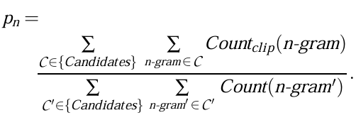
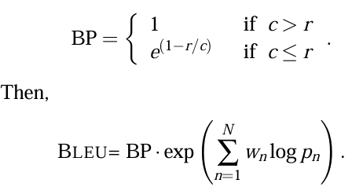
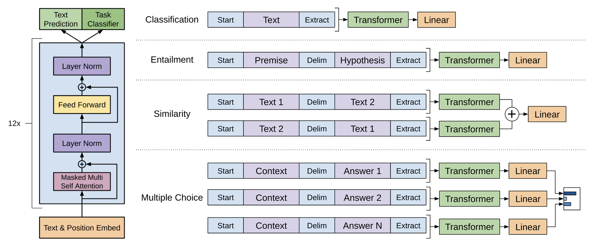

# A Method for Automatic Evaluation of Machine Translaion(BLEU)

# 1. Introduction
## Idea
The closer a machine translation is to a professional human translation, the better it is.

1. a numerical "translation closeness" metric.
2. a corpus of good quality huaman reference translation.

## 2. Baseline BLEU Metric

### 2.1 Modified n-gram precision

A reference word should be considered exhausted after a matching candidate word is identified. (modified unigram precision)
1. clips the total count of each candidate word by its maximum reference count
2. adds these clipped counts up, and divides by the total number of candidate words
先将candidate中单词的总数进行裁剪（不能超过在references中出现的最大次数），接着把这些裁剪之后的数量相加，之后再除以candidate中的单词总数，用来得到modified n-gram precision

e.g.
Candidate: the the the cat is on the mat
Reference1: the cat is on the mat
Reference2: there is a cat on the mat
1. the maximum reference of `the` is 2 (in reference1). So we clip the count of `the` in the candidate by 2.
2. adds these clipped count, 2`the`+1`cat`+1`is`+1`on`+`mat`=6
3. the modified n-gram precison is 6/8 = 0.75

And modified n-gram precision can be computed similarly for any n.
和单个单词一样，先计数在裁剪，之后相加，算比例
This sort of modified n-gram precision scoring captures two aspects of translation: adequacy and fluency. Same words (1-grams) focus on the ***adwquacy***, longer n-gram focus on the ***fluency***

#### Modified n-gram precision on blocks of text
Basic unit of evaluation is the sentence. Refer to the corresponding target sentences as a "sentence"

1. compute the n-gram matches sentence by sentence
2. add the clipped n-gram counts for all the candidate sentences and divide by the number of candidate n-grams in the test corpus to compute a modified precision score $p_n$

简单地单个candidate句子的precision计算公式在多个句子上的推广

### Ranking systems using only modified n-gram precison
1. The metric must also realiably distinguish between translation that do not differ so greatly in quality.
2. Must distinguish between two huam translations of differing quality.

### Combining the modified n-gram precisions
use average logarithm with uniform 

### Sentence brevity penalty
A high-scoring candidate translation must now match the reference translations in length, in word choice. 

make the brevity penalty 1.0 when the candidate's length is the same as any reference transaltion's length. We call the closest reference sentence length the "best match length"

1. compute the test corpus' effective reference length, r, by summing the best match lengths for each candidate sentence in the corpus.
2. choose the brevity penalty to be a decaying exponential in r/c, c is the total length of the candidate translation corpus.

先计算精确度，在乘以brevity penalty

r 是测试集中所有best match sentence长度的总和，先生成candidate，根据candidate从给出的reference中选出best match sentence（长度最接近的句子），最后把这些句子的长度加起来得到r。

# Image Transformer
1. restrict the self-attention to attend to local neighborhoods to process large size images. And still maintain significantly larger receptive fields per layer than typical convolutional neural networks.

## Introduction
Evaluate two different methods of performing conditional image generation with the Image Transformer.
1. In image-class generation condition on an embedding of one of a small number of image classes.
2. In super-resolution with hifh magnification ration, condition on a very low-resolution iamge.

## Model Architecture
### Image Representation

Treat pixel intensities as either discrete categories or ordinal values.

For categories, each of the input pixels' three color channels is encoded using a channel-specific set of 256 d-dimensional embedding vectors of the intensity values 0-255.

For output intensities, share a single, separate set of 256 d-dimensional embeddings across the channels.

For an image of width $w$ and height $h$, we combine the width and channel dimensions yielding a 3-dimensional tensor with shape $[h, w \cdot 3, d]$将图片的width和channel组合到一起，并且进行embedding。（为什么要在这里进行embedding，并且为什么要对所有的channel中的点分别进行embedding）

For ordinal values, run a $1\times 3$ window size, $1\times 3$ strided convolution to combine the 3 channels pre pixel to form an input representation with shape [h, w, d]（这里是用了d个卷积核吗）

To each pixel representation, add a $d$-dimensional encoding of coordinates of that pixel.(sine and cosine functions of the corrdinates)（加上position embedding，different frequencies across different dimension，前d/2 dimension用来encode row number，后d/2用来encode column and color channel）

**Self-Attention** each self-attention layer computes a $d-$dimentional representation for each position, each channel of each pixel.
encoder generate a contextualized, per-pixel-channel representain of the source image
decoder autoregressively generrates an output image of pixel intensities, one channel per pixel at each time step using previously generated pixels and the inpute image representation.
(这里并没有用teacher force，而且在unconditional 和 class-conditional情况下使用decoder-only)
$$
q_a = layernorm(q + dropout(softmax(\frac{W_qq(MW_k)^T}{\sqrt{d}})MW_v))
\\ q' = layernorm(q_a + dropout(W_1ReLu(W_2q_a)))
$$
(这个公式有错误吧。。)
(q is the current representation of the pixel's channel, or position, to be recomputed. Other positions representations are m1, m2, ..., which together comprise the columns of the memory matrix M)

**Local Self-Attention**
time complexity is $O(h\cdot w\cdot l_m\cdot d)$

encoders operate on $8 \times 8$ pixel images.

decoder product $32 \times 32$ pixel images with 3072 positions, rendering attending to all positions impractical.(因为超分辨率要生成的图象巨大，因此使用完整的self-attention不实际)

Changing the neighborhood per query position would prohibit packing most of the computation necessary for self-attention into two matrix multiplications.(如果像CNN一样每个位置的neighborhood都不同，那么需要很多很多矩阵来代表不同的neighborhood的position的representation M)。To avoid this, partition the image into query blocks and associate each of these with a larger memory block that also contains the query block.

For all queries from a given query block, the model attends to the same memory block. The self-attention is the computed for all query blocks in parallel.

**two schemes for choosing query blocks and their associated memory block neighborhoods** resulting in two different factorizations of the joint pixel distribution into conditional distributions.

**1D local Attention** 
1. For 1D local attention first flatten the input tensor with positional encodings in raster-scan order.
2. partition the length into non-overlapping query blocks $Q$ of length $l_q$, padding with zeroes if necessary.
3. for each query block build the memory block $M$ from the same positions as $Q$ and an additional $l_m$ positions corresponding to pixels that have been generated before, which can result in overlapping memory blocks.

# Improving Language Understanding by Generative Pre-Training
## Abstract
Idea: pre-training with unlabeled data and then fine-tune on specific task
## Introduction
Two-stage training procedure. 
1. learn the initial parameters on the unlabeled data
2. adapt these parameters to a target task using the corresponding supervised objective.
## Framework

### Unsupervised pre-training

### Supervised fine-tuning
1. The inputs are passed through pre-trained model to obtain the final transformer block's activation $h_l^m$ 
2. feed the activation into an added linear output layer with parameters $W_y$ to predict $y$
$$
P(y|x^1,...,x^m) = softmax(h_l^mW_y)
$$
maximize
$$
L_2(C) = \sum_{(x,y)}logP(y|x^1,...,x^m)
$$
including language modeling as auxiliary objective to the fine-tuning
1. improve generalization of the supervised model
2. accelerate convergence
$$
L_3(C) = L_2(C) + \lambda \times L_1(C)
$$
The only extra parameters we require during fine-tuning are $W_y$, and embeddings for delimiter tokens.

### Task-specific input transformations
convert structured inputs into an ordered sequence that pre-trained model can process. All transformations include adding randomly initialized start and end tokens $(<s>, <e>)$
